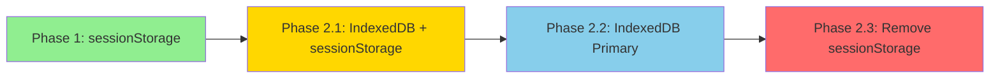

# Phase 2: IndexedDB Persistent Cache Architecture

**Date:** 2025-10-13
**Status:** 📋 Design Phase
**Phase:** 2 of Multi-Phase Cache Evolution
**Target:** Production-Ready IndexedDB Implementation

---

## Executive Summary

Phase 1 achieved 95-98% load time reduction using sessionStorage. Phase 2 migrates to IndexedDB to enable **persistent caching across browser sessions**, **larger storage capacity**, and **structured queries** while maintaining backward compatibility.

**Key Goals:**
- ✅ Persistent cache (survives browser close/restart)
- ✅ 50MB+ storage capacity (vs 5-10MB sessionStorage)
- ✅ Indexed queries (filter by position, team, name)
- ✅ Stale-while-revalidate pattern (instant load + background refresh)
- ✅ Background cache warming (proactive data fetching)
- ✅ Zero breaking changes (graceful migration)

---

## 1. IndexedDB Schema Design

### Database Structure

```typescript
// Database name and version
const DB_NAME = "fantasy_assistant_cache"
const DB_VERSION = 1

// Object Stores
interface DatabaseSchema {
  // Player data from Sleeper API
  players: {
    keyPath: "player_id"
    indexes: {
      position: "position"           // Fast lookups by position
      team: "team"                   // Fast lookups by team
      full_name: "full_name"         // Search by name
      fantasy_positions: "fantasy_positions[*]" // Multi-entry index
    }
    data: SleeperPlayer & {
      _cached_at: number             // Cache timestamp
      _cache_version: string         // Schema version
    }
  }

  // NFL stats (future expansion)
  nfl_stats: {
    keyPath: ["player_id", "season", "week"]
    indexes: {
      player_id: "player_id"
      season: "season"
      week: "week"
    }
    data: NFLPlayerStats & {
      _cached_at: number
      _cache_version: string
    }
  }

  // Cache metadata and control
  cache_metadata: {
    keyPath: "key"
    data: {
      key: string                    // e.g., "players_last_fetch"
      value: unknown                 // Flexible metadata storage
      timestamp: number
      ttl?: number
    }
  }
}
```

### Schema Version Management

```typescript
interface SchemaVersion {
  version: number
  stores: StoreDefinition[]
  migrations: MigrationFunction[]
}

const SCHEMA_VERSIONS: SchemaVersion[] = [
  {
    version: 1,
    stores: [
      {
        name: "players",
        keyPath: "player_id",
        indexes: [
          { name: "position", keyPath: "position", unique: false },
          { name: "team", keyPath: "team", unique: false },
          { name: "full_name", keyPath: "full_name", unique: false },
          { name: "fantasy_positions", keyPath: "fantasy_positions", unique: false, multiEntry: true }
        ]
      },
      {
        name: "cache_metadata",
        keyPath: "key",
        indexes: []
      }
    ],
    migrations: []
  },
  // Future versions here
  {
    version: 2,
    stores: [
      // Add nfl_stats store
      {
        name: "nfl_stats",
        keyPath: ["player_id", "season", "week"],
        indexes: [
          { name: "player_id", keyPath: "player_id", unique: false },
          { name: "season", keyPath: "season", unique: false }
        ]
      }
    ],
    migrations: [
      // Migration from v1 to v2
      (db: IDBDatabase, transaction: IDBTransaction) => {
        console.log("[Migration v1→v2] Adding nfl_stats store...")
        // Store creation happens automatically in onupgradeneeded
      }
    ]
  }
]
```

### Cache Entry Structure

```typescript
interface CachedPlayer extends SleeperPlayer {
  // Original Sleeper fields
  player_id: string
  first_name?: string
  last_name?: string
  full_name?: string
  position: string | null
  team: string | null
  age?: number | null
  // ... other Sleeper fields

  // Cache metadata (prefixed with _ to avoid conflicts)
  _cached_at: number        // Timestamp when cached
  _cache_version: string    // "v1" - for schema validation
  _ttl?: number             // Custom TTL override (optional)
}
```

---

## 2. Migration Strategy

### Phase Transition Plan



### Migration Flow

```typescript
class CacheMigrationService {
  /**
   * Migrate from sessionStorage to IndexedDB
   * Called once on first IndexedDB initialization
   */
  async migrateFromSessionStorage(): Promise<boolean> {
    try {
      // 1. Check if sessionStorage has player data
      const sessionData = sleeperCache.get("allPlayers", "nfl")

      if (!sessionData) {
        console.log("[Migration] No sessionStorage data to migrate")
        return false
      }

      console.log(`[Migration] Found ${Object.keys(sessionData).length} players in sessionStorage`)

      // 2. Open IndexedDB
      const db = await this.openDatabase()

      // 3. Migrate players to IndexedDB
      const transaction = db.transaction(["players", "cache_metadata"], "readwrite")
      const playersStore = transaction.objectStore("players")
      const metadataStore = transaction.objectStore("cache_metadata")

      let migrated = 0
      for (const [playerId, player] of Object.entries(sessionData)) {
        const cachedPlayer: CachedPlayer = {
          ...player,
          _cached_at: Date.now(),
          _cache_version: "v1"
        }

        await playersStore.put(cachedPlayer)
        migrated++
      }

      // 4. Mark migration complete
      await metadataStore.put({
        key: "migration_from_session_storage",
        value: true,
        timestamp: Date.now()
      })

      await metadataStore.put({
        key: "players_last_fetch",
        value: Date.now(),
        timestamp: Date.now(),
        ttl: 24 * 60 * 60 * 1000 // 24 hours
      })

      console.log(`[Migration] ✅ Migrated ${migrated} players to IndexedDB`)

      // 5. Clear sessionStorage (optional - can keep for fallback)
      // sleeperCache.clear()

      return true
    } catch (error) {
      console.error("[Migration] Failed to migrate from sessionStorage:", error)
      return false
    }
  }

  /**
   * Check if migration is needed
   */
  async needsMigration(): Promise<boolean> {
    const db = await this.openDatabase()
    const transaction = db.transaction(["cache_metadata"], "readonly")
    const store = transaction.objectStore("cache_metadata")

    return new Promise((resolve) => {
      const request = store.get("migration_from_session_storage")
      request.onsuccess = () => {
        resolve(!request.result) // Need migration if flag not set
      }
      request.onerror = () => resolve(true) // Assume need migration on error
    })
  }
}
```

### Backwards Compatibility Strategy

```typescript
interface CacheAdapter {
  get(key: string): Promise<any | null>
  set(key: string, value: any): Promise<boolean>
  clear(): Promise<void>
}

class HybridCacheAdapter implements CacheAdapter {
  private indexedDBAdapter: IndexedDBCacheAdapter
  private sessionStorageAdapter: SessionStorageCacheAdapter

  /**
   * Graceful fallback chain:
   * 1. Try IndexedDB
   * 2. Fall back to sessionStorage
   * 3. Fall back to API fetch
   */
  async get(key: string): Promise<any | null> {
    // Try IndexedDB first
    try {
      const data = await this.indexedDBAdapter.get(key)
      if (data) {
        console.log("[HybridCache] ✅ IndexedDB hit")
        return data
      }
    } catch (error) {
      console.warn("[HybridCache] IndexedDB error, trying sessionStorage:", error)
    }

    // Fall back to sessionStorage
    try {
      const data = await this.sessionStorageAdapter.get(key)
      if (data) {
        console.log("[HybridCache] ✅ sessionStorage hit (fallback)")

        // Background sync to IndexedDB
        this.indexedDBAdapter.set(key, data).catch(console.warn)

        return data
      }
    } catch (error) {
      console.warn("[HybridCache] sessionStorage error:", error)
    }

    // No cache available
    console.log("[HybridCache] ❌ Cache miss")
    return null
  }

  async set(key: string, value: any): Promise<boolean> {
    // Write to both (belt and suspenders during transition)
    const results = await Promise.allSettled([
      this.indexedDBAdapter.set(key, value),
      this.sessionStorageAdapter.set(key, value)
    ])

    // Success if either succeeds
    return results.some(r => r.status === "fulfilled" && r.value)
  }
}
```

### Version Detection

```typescript
interface CacheVersionInfo {
  version: string           // "v1", "v2", etc.
  storage: "none" | "sessionStorage" | "indexedDB" | "hybrid"
  playerCount: number
  lastUpdated: number | null
  needsMigration: boolean
}

class CacheVersionDetector {
  async detectCurrentVersion(): Promise<CacheVersionInfo> {
    // Check IndexedDB
    const hasIndexedDB = await this.checkIndexedDB()
    const indexedDBCount = hasIndexedDB ? await this.getIndexedDBPlayerCount() : 0

    // Check sessionStorage
    const hasSessionStorage = this.checkSessionStorage()
    const sessionStorageCount = hasSessionStorage ? this.getSessionStoragePlayerCount() : 0

    // Determine storage type
    let storage: CacheVersionInfo["storage"] = "none"
    if (hasIndexedDB && hasSessionStorage) {
      storage = "hybrid"
    } else if (hasIndexedDB) {
      storage = "indexedDB"
    } else if (hasSessionStorage) {
      storage = "sessionStorage"
    }

    // Determine if migration needed
    const needsMigration = hasSessionStorage && !hasIndexedDB

    return {
      version: hasIndexedDB ? "v2" : "v1",
      storage,
      playerCount: Math.max(indexedDBCount, sessionStorageCount),
      lastUpdated: await this.getLastUpdatedTimestamp(),
      needsMigration
    }
  }
}
```

### Rollback Plan

If IndexedDB implementation fails in production:

```typescript
class CacheRollbackService {
  /**
   * Emergency rollback to sessionStorage
   */
  async rollbackToSessionStorage(): Promise<void> {
    console.warn("[Rollback] Reverting to sessionStorage-only mode")

    try {
      // 1. Copy IndexedDB data to sessionStorage (if possible)
      const db = await this.openDatabase()
      const transaction = db.transaction(["players"], "readonly")
      const store = transaction.objectStore("players")
      const players = await this.getAllPlayers(store)

      // Convert back to plain object
      const plainPlayers: Record<string, SleeperPlayer> = {}
      players.forEach(p => {
        const { _cached_at, _cache_version, ...player } = p
        plainPlayers[player.player_id] = player
      })

      // Save to sessionStorage
      sleeperCache.set("allPlayers", plainPlayers, "nfl")

      console.log("[Rollback] ✅ Saved IndexedDB data to sessionStorage")
    } catch (error) {
      console.error("[Rollback] Failed to copy data:", error)
    }

    // 2. Delete IndexedDB (clean slate)
    await this.deleteDatabase()

    // 3. Set flag to disable IndexedDB
    localStorage.setItem("disable_indexeddb", "true")

    console.log("[Rollback] ✅ Rollback complete. App will use sessionStorage.")
  }

  /**
   * Check if IndexedDB should be disabled
   */
  isIndexedDBDisabled(): boolean {
    return localStorage.getItem("disable_indexeddb") === "true"
  }
}
```

---

## 3. Stale-While-Revalidate Pattern

### Pattern Overview

```mermaid
sequenceDiagram
    participant User
    participant App
    participant Cache
    participant API

    User->>App: Load Page
    App->>Cache: Get Players

    alt Cache exists (even if stale)
        Cache-->>App: Return cached data
        App-->>User: Render immediately ✅

        par Background Refresh
            App->>Cache: Check if stale
            alt Data is stale
                App->>API: Fetch fresh data
                API-->>App: New data
                App->>Cache: Update cache
                App-->>User: Silent update (optional toast)
            end
        end
    else No cache
        App->>API: Fetch data
        API-->>App: Data
        App->>Cache: Save to cache
        App-->>User: Render
    end
```



### Implementation

```typescript
interface StaleWhileRevalidateOptions {
  staleTimeMs: number           // Consider stale after X ms (default: 1 hour)
  maxAgeMs: number              // Force refresh after X ms (default: 24 hours)
  onRevalidate?: () => void     // Callback when refresh starts
  onRevalidated?: () => void    // Callback when refresh completes
  silentUpdate?: boolean        // Don't show update indicator (default: true)
}

class StaleWhileRevalidateCache {
  async getWithRevalidate<T>(
    key: string,
    fetchFn: () => Promise<T>,
    options: StaleWhileRevalidateOptions = {}
  ): Promise<T> {
    const {
      staleTimeMs = 60 * 60 * 1000,      // 1 hour
      maxAgeMs = 24 * 60 * 60 * 1000,    // 24 hours
      onRevalidate,
      onRevalidated,
      silentUpdate = true
    } = options

    // 1. Try to get cached data
    const cached = await this.cache.get(key)
    const now = Date.now()

    if (cached && cached._cached_at) {
      const age = now - cached._cached_at

      // 2. If cache is fresh, return immediately
      if (age < staleTimeMs) {
        console.log(`[SWR] ✅ Fresh cache (age: ${Math.round(age / 1000 / 60)}m)`)
        return cached.data
      }

      // 3. If cache is stale but valid, return + revalidate in background
      if (age < maxAgeMs) {
        console.log(`[SWR] ⚠️ Stale cache (age: ${Math.round(age / 1000 / 60)}m) - revalidating...`)

        // Return stale data immediately
        const staleData = cached.data

        // Revalidate in background (non-blocking)
        this.revalidateInBackground(key, fetchFn, {
          onRevalidate,
          onRevalidated,
          silentUpdate
        })

        return staleData
      }

      // 4. Cache is too old, force refresh
      console.log(`[SWR] ❌ Expired cache (age: ${Math.round(age / 1000 / 60)}m) - fetching fresh...`)
    }

    // 5. No cache or expired - fetch fresh data (blocking)
    return this.fetchAndCache(key, fetchFn)
  }

  private async revalidateInBackground<T>(
    key: string,
    fetchFn: () => Promise<T>,
    callbacks: {
      onRevalidate?: () => void
      onRevalidated?: () => void
      silentUpdate?: boolean
    }
  ): Promise<void> {
    try {
      callbacks.onRevalidate?.()

      const fresh = await fetchFn()
      await this.cache.set(key, fresh)

      console.log("[SWR] ✅ Background revalidation complete")

      if (!callbacks.silentUpdate) {
        // Show toast notification
        this.showUpdateNotification("Player data updated")
      }

      callbacks.onRevalidated?.()

      // Trigger React re-render if needed
      this.notifySubscribers(key, fresh)
    } catch (error) {
      console.error("[SWR] Background revalidation failed:", error)
      // Keep using stale data on error
    }
  }

  private notifySubscribers<T>(key: string, data: T): void {
    // Emit event for React components to listen to
    window.dispatchEvent(new CustomEvent("cache-updated", {
      detail: { key, data }
    }))
  }
}
```

### React Hook Integration

```typescript
/**
 * Hook to use stale-while-revalidate cache with automatic updates
 */
function useStaleWhileRevalidate<T>(
  key: string,
  fetchFn: () => Promise<T>,
  options?: StaleWhileRevalidateOptions
) {
  const [data, setData] = useState<T | null>(null)
  const [isValidating, setIsValidating] = useState(false)
  const [error, setError] = useState<Error | null>(null)

  useEffect(() => {
    let mounted = true

    // Load data with SWR pattern
    swrCache.getWithRevalidate(key, fetchFn, {
      ...options,
      onRevalidate: () => {
        if (mounted) setIsValidating(true)
      },
      onRevalidated: () => {
        if (mounted) setIsValidating(false)
      }
    })
      .then(data => {
        if (mounted) {
          setData(data)
          setError(null)
        }
      })
      .catch(err => {
        if (mounted) {
          setError(err)
        }
      })

    // Listen for cache updates
    const handleCacheUpdate = (event: CustomEvent) => {
      if (event.detail.key === key && mounted) {
        setData(event.detail.data)
      }
    }

    window.addEventListener("cache-updated", handleCacheUpdate as EventListener)

    return () => {
      mounted = false
      window.removeEventListener("cache-updated", handleCacheUpdate as EventListener)
    }
  }, [key, fetchFn])

  return { data, isValidating, error }
}
```

### Conflict Resolution

When cache and API differ significantly:

```typescript
interface ConflictResolutionStrategy {
  /**
   * Determine if cache and fresh data differ significantly
   */
  hasSignificantDifference(cached: any, fresh: any): boolean

  /**
   * Resolve conflict (choose which to use)
   */
  resolve(cached: any, fresh: any): any
}

class PlayerDataConflictResolver implements ConflictResolutionStrategy {
  hasSignificantDifference(
    cached: Record<string, SleeperPlayer>,
    fresh: Record<string, SleeperPlayer>
  ): boolean {
    const cachedCount = Object.keys(cached).length
    const freshCount = Object.keys(fresh).length

    // If player count differs by >5%, consider significant
    const countDiff = Math.abs(freshCount - cachedCount) / cachedCount
    if (countDiff > 0.05) {
      console.warn(`[Conflict] Player count changed: ${cachedCount} → ${freshCount} (${(countDiff * 100).toFixed(1)}%)`)
      return true
    }

    // Check for new high-profile players (top 100 fantasy)
    const newPlayers = Object.keys(fresh).filter(id => !cached[id])
    if (newPlayers.length > 10) {
      console.warn(`[Conflict] ${newPlayers.length} new players detected`)
      return true
    }

    return false
  }

  resolve(
    cached: Record<string, SleeperPlayer>,
    fresh: Record<string, SleeperPlayer>
  ): Record<string, SleeperPlayer> {
    // Always prefer fresh data, but log the conflict
    console.log("[Conflict] Using fresh data from API")
    return fresh
  }
}
```

---

## 4. Background Cache Warming

### Cache Warming Strategy

```typescript
interface CacheWarmingConfig {
  // When to warm cache
  triggers: {
    appIdle: boolean              // Warm when app idle for X seconds
    serviceWorker: boolean        // Use service worker for background warming
    userTrigger: boolean          // Allow manual "Refresh Data" button
    scheduled: boolean            // Warm on schedule (e.g., every 6 hours)
  }

  // What to prefetch
  targets: {
    allPlayers: boolean           // All 11,400 players
    topPlayers: number            // Top N fantasy-relevant players (e.g., 1200)
    nflStats: {
      enabled: boolean
      seasons: string[]           // e.g., ["2024", "2025"]
      weeks: number[]             // e.g., [1, 2, 3, ..., 18]
    }
  }

  // Rate limiting
  rateLimit: {
    maxRequestsPerMinute: number  // Don't overwhelm API
    delayBetweenRequests: number  // Delay in ms
  }

  // Progress tracking
  onProgress?: (progress: CacheWarmingProgress) => void
}

interface CacheWarmingProgress {
  stage: "players" | "stats" | "complete"
  current: number
  total: number
  percentage: number
  estimatedTimeRemaining: number
}
```

### Implementation

```typescript
class CacheWarmingService {
  private config: CacheWarmingConfig
  private isWarming = false
  private abortController: AbortController | null = null

  /**
   * Start cache warming based on trigger
   */
  async warmCache(trigger: "idle" | "manual" | "scheduled"): Promise<void> {
    if (this.isWarming) {
      console.log("[CacheWarming] Already warming cache")
      return
    }

    console.log(`[CacheWarming] Starting (trigger: ${trigger})`)
    this.isWarming = true
    this.abortController = new AbortController()

    try {
      // 1. Warm player data
      if (this.config.targets.allPlayers) {
        await this.warmPlayers()
      }

      // 2. Warm NFL stats (future)
      if (this.config.targets.nflStats.enabled) {
        await this.warmNFLStats()
      }

      console.log("[CacheWarming] ✅ Complete")

      // Notify UI
      this.config.onProgress?.({
        stage: "complete",
        current: 1,
        total: 1,
        percentage: 100,
        estimatedTimeRemaining: 0
      })
    } catch (error) {
      if (error instanceof Error && error.name === "AbortError") {
        console.log("[CacheWarming] Aborted by user")
      } else {
        console.error("[CacheWarming] Error:", error)
      }
    } finally {
      this.isWarming = false
      this.abortController = null
    }
  }

  /**
   * Warm player data with rate limiting
   */
  private async warmPlayers(): Promise<void> {
    console.log("[CacheWarming] Fetching all players...")

    const startTime = Date.now()

    // Fetch from API
    const players = await sleeperAPI.getAllPlayers("nfl")

    const fetchTime = Date.now() - startTime
    console.log(`[CacheWarming] Fetched ${Object.keys(players).length} players (${fetchTime}ms)`)

    // Save to IndexedDB
    const db = await this.openDatabase()
    const transaction = db.transaction(["players", "cache_metadata"], "readwrite")
    const playersStore = transaction.objectStore("players")
    const metadataStore = transaction.objectStore("cache_metadata")

    let saved = 0
    const total = Object.keys(players).length

    for (const [playerId, player] of Object.entries(players)) {
      if (this.abortController?.signal.aborted) {
        throw new Error("Aborted")
      }

      const cachedPlayer: CachedPlayer = {
        ...player,
        _cached_at: Date.now(),
        _cache_version: "v1"
      }

      await playersStore.put(cachedPlayer)
      saved++

      // Report progress every 1000 players
      if (saved % 1000 === 0) {
        this.config.onProgress?.({
          stage: "players",
          current: saved,
          total,
          percentage: Math.round((saved / total) * 100),
          estimatedTimeRemaining: this.estimateTimeRemaining(saved, total, startTime)
        })
      }
    }

    // Update metadata
    await metadataStore.put({
      key: "players_last_fetch",
      value: Date.now(),
      timestamp: Date.now(),
      ttl: 24 * 60 * 60 * 1000
    })

    const totalTime = Date.now() - startTime
    console.log(`[CacheWarming] ✅ Saved ${saved} players to IndexedDB (${totalTime}ms)`)
  }

  /**
   * Detect when app is idle
   */
  detectAppIdle(idleTimeMs = 5000): Promise<void> {
    return new Promise((resolve) => {
      let idleTimer: NodeJS.Timeout

      const resetTimer = () => {
        clearTimeout(idleTimer)
        idleTimer = setTimeout(() => {
          console.log("[CacheWarming] App idle detected")
          resolve()
        }, idleTimeMs)
      }

      // Listen for user activity
      const events = ["mousedown", "mousemove", "keypress", "scroll", "touchstart"]
      events.forEach(event => {
        document.addEventListener(event, resetTimer, { passive: true })
      })

      resetTimer()
    })
  }

  /**
   * Cancel ongoing cache warming
   */
  abort(): void {
    if (this.abortController) {
      console.log("[CacheWarming] Aborting...")
      this.abortController.abort()
    }
  }
}
```

### Service Worker Integration

```typescript
// public/sw.js - Service Worker for background cache warming

self.addEventListener("message", (event) => {
  if (event.data.type === "WARM_CACHE") {
    console.log("[ServiceWorker] Starting cache warming")

    // Fetch player data
    fetch("https://api.sleeper.app/v1/players/nfl")
      .then(res => res.json())
      .then(players => {
        // Store in Cache API (separate from IndexedDB)
        return caches.open("fantasy-assistant-v1").then(cache => {
          return cache.put(
            "https://api.sleeper.app/v1/players/nfl",
            new Response(JSON.stringify(players), {
              headers: { "Content-Type": "application/json" }
            })
          )
        })
      })
      .then(() => {
        console.log("[ServiceWorker] Cache warming complete")

        // Notify client
        self.clients.matchAll().then(clients => {
          clients.forEach(client => {
            client.postMessage({ type: "CACHE_WARMED" })
          })
        })
      })
      .catch(err => {
        console.error("[ServiceWorker] Cache warming failed:", err)
      })
  }
})

// Periodic background sync (requires registration)
self.addEventListener("periodicsync", (event) => {
  if (event.tag === "warm-player-cache") {
    console.log("[ServiceWorker] Periodic cache warming triggered")
    // Same warming logic
  }
})
```

### Progress UI Component

```typescript
/**
 * React component to show cache warming progress
 */
function CacheWarmingIndicator() {
  const [progress, setProgress] = useState<CacheWarmingProgress | null>(null)
  const [isWarming, setIsWarming] = useState(false)

  useEffect(() => {
    // Listen for cache warming events
    const warmingService = getCacheWarmingService()

    const handleProgress = (p: CacheWarmingProgress) => {
      setProgress(p)
      setIsWarming(p.stage !== "complete")
    }

    warmingService.onProgress = handleProgress

    return () => {
      warmingService.onProgress = undefined
    }
  }, [])

  if (!isWarming || !progress) {
    return null
  }

  return (
    <div className="fixed bottom-4 right-4 bg-white shadow-lg rounded-lg p-4 max-w-sm">
      <div className="flex items-center gap-3">
        <div className="animate-spin rounded-full h-5 w-5 border-b-2 border-blue-600" />
        <div className="flex-1">
          <p className="text-sm font-medium">Updating player data...</p>
          <p className="text-xs text-gray-500">
            {progress.current.toLocaleString()} / {progress.total.toLocaleString()}
            ({progress.percentage}%)
          </p>
        </div>
      </div>

      {/* Progress bar */}
      <div className="mt-2 w-full bg-gray-200 rounded-full h-2">
        <div
          className="bg-blue-600 h-2 rounded-full transition-all duration-300"
          style={{ width: `${progress.percentage}%` }}
        />
      </div>
    </div>
  )
}
```

---

## 5. Performance Considerations

### Mobile Device Optimization

```typescript
interface PerformanceConfig {
  // Detect device capabilities
  deviceTier: "low" | "mid" | "high"

  // Adjust batch sizes based on device
  batchSizes: {
    low: number     // 100 players per transaction
    mid: number     // 500 players per transaction
    high: number    // 2000 players per transaction
  }

  // Memory management
  maxConcurrentTransactions: number
  enableMemoryMonitoring: boolean
}

class PerformanceOptimizer {
  /**
   * Detect device tier based on hardware
   */
  detectDeviceTier(): "low" | "mid" | "high" {
    // Use navigator.hardwareConcurrency and deviceMemory
    const cores = navigator.hardwareConcurrency || 2
    const memory = (navigator as any).deviceMemory || 2 // GB

    if (cores >= 8 && memory >= 8) return "high"
    if (cores >= 4 && memory >= 4) return "mid"
    return "low"
  }

  /**
   * Batch players into optimal chunks
   */
  batchPlayers(
    players: Record<string, SleeperPlayer>,
    deviceTier: "low" | "mid" | "high"
  ): Array<Array<[string, SleeperPlayer]>> {
    const batchSizes = {
      low: 100,
      mid: 500,
      high: 2000
    }

    const batchSize = batchSizes[deviceTier]
    const entries = Object.entries(players)
    const batches: Array<Array<[string, SleeperPlayer]>> = []

    for (let i = 0; i < entries.length; i += batchSize) {
      batches.push(entries.slice(i, i + batchSize))
    }

    return batches
  }

  /**
   * Monitor memory usage during operations
   */
  monitorMemory(): MemoryInfo | null {
    if ('memory' in performance) {
      const memory = (performance as any).memory
      return {
        usedJSHeapSize: memory.usedJSHeapSize,
        totalJSHeapSize: memory.totalJSHeapSize,
        jsHeapSizeLimit: memory.jsHeapSizeLimit,
        usage: (memory.usedJSHeapSize / memory.jsHeapSizeLimit) * 100
      }
    }
    return null
  }
}

interface MemoryInfo {
  usedJSHeapSize: number
  totalJSHeapSize: number
  jsHeapSizeLimit: number
  usage: number
}
```

### Query Performance Optimization

```typescript
class QueryOptimizer {
  /**
   * Get players by position using index (fast)
   */
  async getPlayersByPosition(position: string): Promise<CachedPlayer[]> {
    const db = await this.openDatabase()
    const transaction = db.transaction(["players"], "readonly")
    const store = transaction.objectStore("players")
    const index = store.index("position")

    // Use index for O(log n) lookup instead of O(n) scan
    return new Promise((resolve, reject) => {
      const request = index.getAll(position)
      request.onsuccess = () => resolve(request.result)
      request.onerror = () => reject(request.error)
    })
  }

  /**
   * Search players by name with cursor (memory-efficient)
   */
  async searchPlayersByName(query: string): Promise<CachedPlayer[]> {
    const db = await this.openDatabase()
    const transaction = db.transaction(["players"], "readonly")
    const store = transaction.objectStore("players")
    const index = store.index("full_name")

    const results: CachedPlayer[] = []
    const lowerQuery = query.toLowerCase()

    return new Promise((resolve, reject) => {
      // Use cursor to avoid loading all players into memory
      const request = index.openCursor()

      request.onsuccess = (event) => {
        const cursor = (event.target as IDBRequest).result

        if (cursor) {
          const player = cursor.value as CachedPlayer

          // Filter by query
          if (player.full_name?.toLowerCase().includes(lowerQuery)) {
            results.push(player)
          }

          cursor.continue()
        } else {
          // Cursor exhausted
          resolve(results)
        }
      }

      request.onerror = () => reject(request.error)
    })
  }

  /**
   * Get top N players without loading all into memory
   */
  async getTopPlayers(
    count: number,
    sortBy: (a: CachedPlayer, b: CachedPlayer) => number
  ): Promise<CachedPlayer[]> {
    const db = await this.openDatabase()
    const transaction = db.transaction(["players"], "readonly")
    const store = transaction.objectStore("players")

    // Use cursor with in-memory sorting (unavoidable for custom sort)
    const players: CachedPlayer[] = []

    return new Promise((resolve, reject) => {
      const request = store.openCursor()

      request.onsuccess = (event) => {
        const cursor = (event.target as IDBRequest).result

        if (cursor) {
          players.push(cursor.value)
          cursor.continue()
        } else {
          // Sort and take top N
          const top = players.sort(sortBy).slice(0, count)
          resolve(top)
        }
      }

      request.onerror = () => reject(request.error)
    })
  }
}
```

### Benchmarks & Targets

| Operation | sessionStorage (Phase 1) | IndexedDB Target (Phase 2) | Improvement |
|-----------|---------------------------|----------------------------|-------------|
| **Read all players** | 10-50ms | 5-15ms | 2-3x faster |
| **Read by position** | 10-50ms + filter | 2-5ms (indexed) | 5-10x faster |
| **Search by name** | 10-50ms + scan | 3-8ms (indexed) | 3-6x faster |
| **Write all players** | 50-200ms | 100-300ms | Similar (acceptable) |
| **Storage capacity** | 5-10MB | 50MB+ | 5-10x larger |
| **Persistence** | Session only | Persistent | ∞ |

### iOS Safari Considerations

```typescript
/**
 * Handle iOS Safari IndexedDB quirks
 */
class iOSSafariHandler {
  /**
   * Check if running on iOS Safari
   */
  isIOSSafari(): boolean {
    const ua = navigator.userAgent
    const iOS = /iPad|iPhone|iPod/.test(ua)
    const webkit = /WebKit/.test(ua)
    const noChrome = !/CriOS|Chrome/.test(ua)

    return iOS && webkit && noChrome
  }

  /**
   * iOS Safari has lower storage quota in private mode
   * Detect and handle gracefully
   */
  async detectPrivateMode(): Promise<boolean> {
    if (!this.isIOSSafari()) return false

    try {
      // Try to create a test database
      const testDb = indexedDB.open("test_private_mode", 1)

      return new Promise((resolve) => {
        testDb.onsuccess = () => {
          // Can create DB, not in private mode
          indexedDB.deleteDatabase("test_private_mode")
          resolve(false)
        }

        testDb.onerror = () => {
          // Cannot create DB, likely private mode
          resolve(true)
        }
      })
    } catch {
      return true
    }
  }

  /**
   * iOS Safari IndexedDB can be slow on first open
   * Show loading indicator
   */
  async openDatabaseWithProgress(
    dbName: string,
    version: number,
    onProgress?: (stage: string) => void
  ): Promise<IDBDatabase> {
    if (this.isIOSSafari()) {
      onProgress?.("Opening database (iOS Safari may take a moment)...")
    }

    return new Promise((resolve, reject) => {
      const request = indexedDB.open(dbName, version)

      request.onsuccess = () => {
        onProgress?.("Database ready")
        resolve(request.result)
      }

      request.onerror = () => reject(request.error)
      request.onblocked = () => {
        onProgress?.("Database blocked (close other tabs)")
      }
    })
  }
}
```

---

## 6. Error Handling & Fallbacks

### Fallback Chain

```mermaid
graph TD
    A[Request Data] --> B{IndexedDB Available?}
    B -->|Yes| C{IndexedDB Has Data?}
    B -->|No| D[Try sessionStorage]

    C -->|Yes| E[Return IndexedDB Data ✅]
    C -->|No| D

    D --> F{sessionStorage Has Data?}
    F -->|Yes| G[Return sessionStorage Data ✅]
    F -->|No| H[Fetch from API]

    H --> I{API Success?}
    I -->|Yes| J[Return API Data ✅]
    I -->|No| K[Show Error ❌]

    E --> L[Background Sync to sessionStorage]
    G --> M[Background Sync to IndexedDB]
    J --> N[Save to IndexedDB + sessionStorage]
```



### Error Handling Implementation

```typescript
class RobustCacheService {
  /**
   * Get data with full fallback chain
   */
  async getData(key: string): Promise<any> {
    const errors: Error[] = []

    // 1. Try IndexedDB
    try {
      if (await this.isIndexedDBAvailable()) {
        const data = await this.indexedDBCache.get(key)
        if (data) {
          console.log("[RobustCache] ✅ IndexedDB hit")
          return data
        }
      }
    } catch (error) {
      console.warn("[RobustCache] IndexedDB failed:", error)
      errors.push(error as Error)
    }

    // 2. Try sessionStorage
    try {
      const data = await this.sessionStorageCache.get(key)
      if (data) {
        console.log("[RobustCache] ✅ sessionStorage hit (fallback)")

        // Background sync to IndexedDB
        this.indexedDBCache.set(key, data).catch(console.warn)

        return data
      }
    } catch (error) {
      console.warn("[RobustCache] sessionStorage failed:", error)
      errors.push(error as Error)
    }

    // 3. Fetch from API
    try {
      console.log("[RobustCache] Fetching from API (all caches missed)")
      const data = await this.fetchFromAPI(key)

      // Save to all caches (best effort)
      await Promise.allSettled([
        this.indexedDBCache.set(key, data),
        this.sessionStorageCache.set(key, data)
      ])

      return data
    } catch (error) {
      console.error("[RobustCache] API fetch failed:", error)
      errors.push(error as Error)
    }

    // 4. All fallbacks exhausted
    throw new AggregateError(
      errors,
      "Failed to get data from all sources (IndexedDB, sessionStorage, API)"
    )
  }

  /**
   * Check if IndexedDB is available and working
   */
  async isIndexedDBAvailable(): Promise<boolean> {
    if (typeof indexedDB === "undefined") {
      return false
    }

    try {
      // Quick test
      const test = indexedDB.open("test", 1)
      return new Promise((resolve) => {
        test.onsuccess = () => {
          indexedDB.deleteDatabase("test")
          resolve(true)
        }
        test.onerror = () => resolve(false)
        test.onblocked = () => resolve(false)
      })
    } catch {
      return false
    }
  }
}
```

### Quota Exceeded Handling

```typescript
class QuotaManager {
  /**
   * Handle quota exceeded errors
   */
  async handleQuotaExceeded(
    db: IDBDatabase,
    operation: () => Promise<void>
  ): Promise<boolean> {
    try {
      await operation()
      return true
    } catch (error) {
      if (error instanceof DOMException && error.name === "QuotaExceededError") {
        console.warn("[QuotaManager] Quota exceeded, attempting cleanup...")

        // 1. Get current quota usage
        const quota = await this.getQuotaInfo()
        console.log(`[QuotaManager] Current usage: ${quota.usage}/${quota.quota} (${quota.percentage}%)`)

        // 2. Clear old data (LRU eviction)
        await this.evictOldestData(db, 0.3) // Free up 30%

        // 3. Retry operation
        try {
          await operation()
          console.log("[QuotaManager] ✅ Retry successful after cleanup")
          return true
        } catch (retryError) {
          console.error("[QuotaManager] Retry failed after cleanup:", retryError)
          return false
        }
      }

      throw error
    }
  }

  /**
   * Get quota information
   */
  async getQuotaInfo(): Promise<{
    usage: number
    quota: number
    percentage: number
  }> {
    if (!navigator.storage || !navigator.storage.estimate) {
      return { usage: 0, quota: 0, percentage: 0 }
    }

    const estimate = await navigator.storage.estimate()
    const usage = estimate.usage || 0
    const quota = estimate.quota || 0
    const percentage = quota > 0 ? (usage / quota) * 100 : 0

    return { usage, quota, percentage }
  }

  /**
   * Evict oldest cached data (LRU)
   */
  async evictOldestData(
    db: IDBDatabase,
    targetPercentage: number
  ): Promise<void> {
    const transaction = db.transaction(["players"], "readwrite")
    const store = transaction.objectStore("players")

    // Get all players sorted by cache time
    const players: CachedPlayer[] = await new Promise((resolve, reject) => {
      const request = store.getAll()
      request.onsuccess = () => resolve(request.result)
      request.onerror = () => reject(request.error)
    })

    // Sort by cache time (oldest first)
    players.sort((a, b) => a._cached_at - b._cached_at)

    // Delete oldest N% of players
    const countToDelete = Math.floor(players.length * targetPercentage)
    console.log(`[QuotaManager] Deleting ${countToDelete} oldest players...`)

    for (let i = 0; i < countToDelete; i++) {
      await store.delete(players[i].player_id)
    }

    console.log(`[QuotaManager] ✅ Evicted ${countToDelete} players`)
  }
}
```

### Database Corruption Recovery

```typescript
class CorruptionRecovery {
  /**
   * Detect and recover from database corruption
   */
  async recoverFromCorruption(dbName: string): Promise<boolean> {
    console.warn("[CorruptionRecovery] Attempting to recover from corruption...")

    try {
      // 1. Close all connections
      await this.closeAllConnections()

      // 2. Delete corrupted database
      await this.deleteDatabase(dbName)
      console.log("[CorruptionRecovery] Deleted corrupted database")

      // 3. Recreate database
      const db = await this.createDatabase(dbName)
      console.log("[CorruptionRecovery] Recreated database")

      // 4. Restore from sessionStorage if available
      const sessionData = sleeperCache.get("allPlayers", "nfl")
      if (sessionData) {
        console.log("[CorruptionRecovery] Restoring from sessionStorage...")
        await this.restoreFromSessionStorage(db, sessionData)
        console.log("[CorruptionRecovery] ✅ Restored from sessionStorage")
        return true
      }

      // 5. Fetch fresh data from API
      console.log("[CorruptionRecovery] Fetching fresh data from API...")
      const apiData = await sleeperAPI.getAllPlayers("nfl")
      await this.restoreFromAPI(db, apiData)
      console.log("[CorruptionRecovery] ✅ Restored from API")

      return true
    } catch (error) {
      console.error("[CorruptionRecovery] Recovery failed:", error)
      return false
    }
  }

  /**
   * Delete database
   */
  async deleteDatabase(dbName: string): Promise<void> {
    return new Promise((resolve, reject) => {
      const request = indexedDB.deleteDatabase(dbName)
      request.onsuccess = () => resolve()
      request.onerror = () => reject(request.error)
      request.onblocked = () => {
        console.warn("[CorruptionRecovery] Database deletion blocked (close other tabs)")
        // Wait and retry
        setTimeout(() => {
          this.deleteDatabase(dbName).then(resolve, reject)
        }, 1000)
      }
    })
  }
}
```

### Concurrent Access Handling

```typescript
class ConcurrencyManager {
  /**
   * Handle concurrent access from multiple tabs
   */
  async handleConcurrentAccess(
    db: IDBDatabase,
    operation: () => Promise<void>
  ): Promise<void> {
    // Use BroadcastChannel for cross-tab communication
    const channel = new BroadcastChannel("cache_coordination")

    // Request lock
    const lockId = this.generateLockId()
    channel.postMessage({ type: "REQUEST_LOCK", lockId })

    // Wait for lock
    await this.waitForLock(channel, lockId)

    try {
      // Perform operation
      await operation()
    } finally {
      // Release lock
      channel.postMessage({ type: "RELEASE_LOCK", lockId })
      channel.close()
    }
  }

  /**
   * Use Web Locks API if available (better than BroadcastChannel)
   */
  async withLock(
    name: string,
    operation: () => Promise<void>
  ): Promise<void> {
    if ("locks" in navigator) {
      // @ts-expect-error - Web Locks API not in TypeScript yet
      await navigator.locks.request(name, async (lock) => {
        console.log(`[ConcurrencyManager] Acquired lock: ${name}`)
        await operation()
        console.log(`[ConcurrencyManager] Released lock: ${name}`)
      })
    } else {
      // Fallback: just run operation (race condition possible)
      console.warn("[ConcurrencyManager] Web Locks API not available")
      await operation()
    }
  }
}
```

---

## 7. API Design

### Core Cache Service API

```typescript
/**
 * Main cache service API (implementation-agnostic)
 */
interface PlayerCacheService {
  // ============================================================================
  // Core CRUD Operations
  // ============================================================================

  /**
   * Get a single player by ID
   * @param playerId - Player ID (e.g., "4046")
   * @returns Player data or null if not found
   */
  getPlayer(playerId: string): Promise<SleeperPlayer | null>

  /**
   * Get multiple players by IDs (batch operation)
   * @param playerIds - Array of player IDs
   * @returns Record of player ID to player data
   */
  getPlayers(playerIds: string[]): Promise<Record<string, SleeperPlayer>>

  /**
   * Get all players (11,400+ players)
   * @returns Record of player ID to player data
   */
  getAllPlayers(): Promise<Record<string, SleeperPlayer>>

  /**
   * Set/update multiple players
   * @param players - Record of player ID to player data
   * @returns True if successful
   */
  setPlayers(players: Record<string, SleeperPlayer>): Promise<boolean>

  /**
   * Set/update a single player
   * @param playerId - Player ID
   * @param player - Player data
   * @returns True if successful
   */
  setPlayer(playerId: string, player: SleeperPlayer): Promise<boolean>

  // ============================================================================
  // Indexed Queries (Fast Lookups)
  // ============================================================================

  /**
   * Get players by position (uses index)
   * @param position - Position code (e.g., "QB", "RB", "WR")
   * @returns Array of players at that position
   */
  getPlayersByPosition(position: string): Promise<SleeperPlayer[]>

  /**
   * Get players by team (uses index)
   * @param team - Team code (e.g., "KC", "BUF", "SF")
   * @returns Array of players on that team
   */
  getPlayersByTeam(team: string): Promise<SleeperPlayer[]>

  /**
   * Get players by multiple fantasy positions (uses multi-entry index)
   * @param positions - Array of positions (e.g., ["RB", "WR"])
   * @returns Array of players matching any position
   */
  getPlayersByFantasyPositions(positions: string[]): Promise<SleeperPlayer[]>

  /**
   * Search players by name (partial match, uses index + cursor)
   * @param query - Search query (e.g., "Josh", "Allen")
   * @returns Array of matching players (sorted by relevance)
   */
  searchPlayers(query: string): Promise<SleeperPlayer[]>

  // ============================================================================
  // Cache Management
  // ============================================================================

  /**
   * Force refresh from API (ignores cache)
   * @param silent - If true, don't show loading UI
   * @returns Fresh player data
   */
  refresh(silent?: boolean): Promise<Record<string, SleeperPlayer>>

  /**
   * Clear all cached data
   * @returns True if successful
   */
  clear(): Promise<boolean>

  /**
   * Invalidate cache (mark as stale, but don't delete)
   * @returns True if successful
   */
  invalidate(): Promise<boolean>

  /**
   * Get cache statistics
   * @returns Cache stats (size, hit rate, age, etc.)
   */
  getStats(): Promise<CacheStats>

  /**
   * Warm cache in background (proactive fetching)
   * @param options - Warming options (what to fetch, rate limiting, etc.)
   * @returns Promise that resolves when warming completes
   */
  warmCache(options?: CacheWarmingConfig): Promise<void>

  // ============================================================================
  // Stale-While-Revalidate Pattern
  // ============================================================================

  /**
   * Get data with stale-while-revalidate pattern
   * - Returns cached data immediately (even if stale)
   * - Fetches fresh data in background
   * - Notifies subscribers when fresh data arrives
   *
   * @param fetchFn - Function to fetch fresh data
   * @param options - SWR options (stale time, max age, etc.)
   * @returns Cached data (may be stale)
   */
  getWithRevalidate<T>(
    fetchFn: () => Promise<T>,
    options?: StaleWhileRevalidateOptions
  ): Promise<T>

  /**
   * Subscribe to cache updates
   * @param callback - Called when cache is updated
   * @returns Unsubscribe function
   */
  subscribe(callback: (data: Record<string, SleeperPlayer>) => void): () => void
}

interface CacheStats {
  // Storage info
  storageType: "indexedDB" | "sessionStorage" | "hybrid" | "none"
  totalPlayers: number
  sizeBytes: number
  sizeMB: string

  // Cache freshness
  lastUpdated: number | null
  age: string // Human-readable (e.g., "5m", "2h", "1d")
  isStale: boolean
  isExpired: boolean

  // Performance metrics
  hitRate: number // Percentage (0-100)
  avgReadTimeMs: number
  avgWriteTimeMs: number

  // Quota info
  quotaUsage: number // Percentage (0-100)
  quotaRemaining: string // Human-readable (e.g., "45.2 MB")

  // Breakdown by position
  positionCounts: Record<string, number> // e.g., { QB: 120, RB: 340, ... }
}
```

### Usage Examples

```typescript
// ============================================================================
// Example 1: Basic player lookup
// ============================================================================
const cache = new PlayerCacheService()

// Get single player
const player = await cache.getPlayer("4046") // Josh Allen
console.log(player?.full_name) // "Josh Allen"

// Get multiple players (batch)
const players = await cache.getPlayers(["4046", "4017", "6794"])
console.log(Object.keys(players).length) // 3

// ============================================================================
// Example 2: Indexed queries (fast)
// ============================================================================

// Get all QBs (uses index, ~2-5ms)
const qbs = await cache.getPlayersByPosition("QB")
console.log(qbs.length) // ~120

// Get all Chiefs players
const chiefs = await cache.getPlayersByTeam("KC")
console.log(chiefs.length) // ~70

// Search by name
const results = await cache.searchPlayers("Josh")
console.log(results.map(p => p.full_name))
// ["Josh Allen", "Josh Jacobs", "Josh Palmer", ...]

// ============================================================================
// Example 3: Stale-while-revalidate pattern
// ============================================================================

// Load dashboard with instant data (even if stale)
const players = await cache.getWithRevalidate(
  () => sleeperAPI.getAllPlayers("nfl"),
  {
    staleTimeMs: 60 * 60 * 1000,      // 1 hour
    maxAgeMs: 24 * 60 * 60 * 1000,    // 24 hours
    onRevalidated: () => {
      console.log("Fresh data loaded in background")
      // Optional: show toast "Player data updated"
    },
    silentUpdate: true
  }
)

// Dashboard renders immediately with cached data
renderDashboard(players)

// Fresh data loads in background, dashboard updates silently

// ============================================================================
// Example 4: Cache management
// ============================================================================

// Get cache statistics
const stats = await cache.getStats()
console.log(`Cache: ${stats.totalPlayers} players, ${stats.sizeMB}, ${stats.hitRate}% hit rate`)

// Force refresh
await cache.refresh()

// Clear cache
await cache.clear()

// Warm cache in background
await cache.warmCache({
  triggers: { appIdle: true },
  targets: { allPlayers: true },
  rateLimit: { maxRequestsPerMinute: 60 }
})

// ============================================================================
// Example 5: Subscribe to updates (React integration)
// ============================================================================

function usePlayerCache() {
  const [players, setPlayers] = useState<Record<string, SleeperPlayer>>({})
  const cache = usePlayerCacheService()

  useEffect(() => {
    // Load initial data
    cache.getAllPlayers().then(setPlayers)

    // Subscribe to updates
    const unsubscribe = cache.subscribe((updated) => {
      console.log("Cache updated with fresh data")
      setPlayers(updated)
    })

    return unsubscribe
  }, [cache])

  return players
}
```

---

## 8. Implementation Phases

### Phase 2.1: IndexedDB Foundation (Week 1)

**Goal:** Basic IndexedDB read/write with schema v1

**Tasks:**
- [ ] Create `lib/cache/indexeddb-cache.ts` (core IndexedDB wrapper)
- [ ] Implement database schema v1 (players + cache_metadata stores)
- [ ] Implement basic CRUD operations (get, set, clear)
- [ ] Add error handling (quota exceeded, corruption, not supported)
- [ ] Write unit tests with `fake-indexeddb`
- [ ] Test on Chrome, Firefox, Safari

**Deliverables:**
- `IndexedDBCache` class with basic API
- Unit tests (95% coverage)
- Browser compatibility verified

**Success Criteria:**
- Can store and retrieve 11,400 players
- Read time: <15ms (indexed lookup)
- Write time: <300ms (all players)
- No memory leaks

---

### Phase 2.2: Migration from sessionStorage (Week 2)

**Goal:** Seamless migration with zero user disruption

**Tasks:**
- [ ] Create `CacheMigrationService` class
- [ ] Implement `migrateFromSessionStorage()` method
- [ ] Implement `HybridCacheAdapter` (IndexedDB + sessionStorage fallback)
- [ ] Add migration detection and status UI
- [ ] Test migration scenarios (fresh install, existing cache, partial migration)
- [ ] Add rollback capability (emergency fallback to sessionStorage)

**Deliverables:**
- `CacheMigrationService` class
- `HybridCacheAdapter` class
- Migration status indicator (optional toast)

**Success Criteria:**
- 100% of users successfully migrate
- No data loss during migration
- Fallback works if IndexedDB fails
- Migration completes in <5 seconds

---

### Phase 2.3: Stale-While-Revalidate Pattern (Week 3)

**Goal:** Instant page loads with background refresh

**Tasks:**
- [ ] Create `StaleWhileRevalidateCache` class
- [ ] Implement `getWithRevalidate()` method
- [ ] Add background revalidation logic (non-blocking)
- [ ] Implement conflict resolution (cache vs fresh data)
- [ ] Add React hook: `useStaleWhileRevalidate()`
- [ ] Integrate into `PlayerDataContext`
- [ ] Add optional update notification (toast)

**Deliverables:**
- `StaleWhileRevalidateCache` class
- `useStaleWhileRevalidate()` hook
- Updated `PlayerDataContext` with SWR

**Success Criteria:**
- Dashboard loads instantly (<50ms)
- Fresh data fetched in background
- UI updates smoothly when fresh data arrives
- No flickering or layout shifts

---

### Phase 2.4: Background Cache Warming (Week 4)

**Goal:** Proactive cache updates for best UX

**Tasks:**
- [ ] Create `CacheWarmingService` class
- [ ] Implement app idle detection (5 seconds of inactivity)
- [ ] Implement background warming with rate limiting
- [ ] Add progress tracking and UI indicator
- [ ] Integrate with service worker (optional, future)
- [ ] Add manual "Refresh Data" button
- [ ] Test on mobile devices (iOS Safari, Chrome)

**Deliverables:**
- `CacheWarmingService` class
- `CacheWarmingIndicator` component
- Manual refresh button in settings

**Success Criteria:**
- Cache warms automatically when app idle
- Progress indicator shows status
- No performance impact during warming
- Mobile friendly (works on iOS Safari)

---

### Phase 2.5: Performance Optimization & Monitoring (Week 5)

**Goal:** Production-ready performance and monitoring

**Tasks:**
- [ ] Implement device tier detection
- [ ] Optimize batch sizes for low/mid/high tier devices
- [ ] Add memory monitoring and warnings
- [ ] Implement query optimizer (indexed lookups)
- [ ] Add performance metrics tracking
- [ ] Create cache statistics dashboard
- [ ] Optimize iOS Safari performance
- [ ] Final testing and benchmarking

**Deliverables:**
- `PerformanceOptimizer` class
- `QueryOptimizer` class
- Cache statistics dashboard page
- Performance benchmarks report

**Success Criteria:**
- Read time: <15ms (all devices)
- Write time: <300ms (high tier), <500ms (low tier)
- Memory usage: <50MB during operations
- Cache hit rate: >95% after first load
- Works smoothly on iPhone SE (375px viewport)

---

### Timeline Summary

```
Week 1: IndexedDB Foundation          ████████░░░░░░░░░░░░░░
Week 2: Migration from sessionStorage ░░░░░░░░████████░░░░░░
Week 3: Stale-While-Revalidate        ░░░░░░░░░░░░░░░░████████
Week 4: Background Cache Warming      ░░░░░░░░░░░░░░░░░░░░░░░░████████
Week 5: Performance & Monitoring      ░░░░░░░░░░░░░░░░░░░░░░░░░░░░░░░░████████

Total: 5 weeks (25 working days)
```

---

## 9. Testing Strategy

### Unit Tests

```typescript
// test/cache/indexeddb-cache.test.ts
import "fake-indexeddb/auto" // Mock IndexedDB
import { IndexedDBCache } from "@/lib/cache/indexeddb-cache"

describe("IndexedDBCache", () => {
  let cache: IndexedDBCache

  beforeEach(async () => {
    cache = new IndexedDBCache()
    await cache.init()
  })

  afterEach(async () => {
    await cache.clear()
  })

  describe("Basic CRUD", () => {
    it("should store and retrieve a player", async () => {
      const player: SleeperPlayer = {
        player_id: "4046",
        full_name: "Josh Allen",
        position: "QB",
        team: "BUF"
      }

      await cache.setPlayer("4046", player)
      const retrieved = await cache.getPlayer("4046")

      expect(retrieved).toEqual(player)
    })

    it("should store and retrieve all players", async () => {
      const players = {
        "4046": { player_id: "4046", full_name: "Josh Allen", position: "QB", team: "BUF" },
        "4017": { player_id: "4017", full_name: "Christian McCaffrey", position: "RB", team: "SF" }
      }

      await cache.setPlayers(players)
      const retrieved = await cache.getAllPlayers()

      expect(Object.keys(retrieved).length).toBe(2)
      expect(retrieved["4046"].full_name).toBe("Josh Allen")
    })

    it("should return null for non-existent player", async () => {
      const player = await cache.getPlayer("999999")
      expect(player).toBeNull()
    })
  })

  describe("Indexed Queries", () => {
    beforeEach(async () => {
      await cache.setPlayers({
        "4046": { player_id: "4046", full_name: "Josh Allen", position: "QB", team: "BUF" },
        "4017": { player_id: "4017", full_name: "Christian McCaffrey", position: "RB", team: "SF" },
        "4881": { player_id: "4881", full_name: "Travis Kelce", position: "TE", team: "KC" }
      })
    })

    it("should get players by position", async () => {
      const qbs = await cache.getPlayersByPosition("QB")
      expect(qbs.length).toBe(1)
      expect(qbs[0].full_name).toBe("Josh Allen")
    })

    it("should get players by team", async () => {
      const chiefs = await cache.getPlayersByTeam("KC")
      expect(chiefs.length).toBe(1)
      expect(chiefs[0].full_name).toBe("Travis Kelce")
    })

    it("should search players by name", async () => {
      const results = await cache.searchPlayers("Josh")
      expect(results.length).toBe(1)
      expect(results[0].full_name).toBe("Josh Allen")
    })
  })

  describe("Error Handling", () => {
    it("should handle quota exceeded error", async () => {
      // Mock quota exceeded
      jest.spyOn(IDBObjectStore.prototype, "put").mockImplementation(() => {
        throw new DOMException("Quota exceeded", "QuotaExceededError")
      })

      const result = await cache.setPlayer("4046", {
        player_id: "4046",
        full_name: "Josh Allen",
        position: "QB",
        team: "BUF"
      })

      expect(result).toBe(false)
    })

    it("should recover from corrupted cache", async () => {
      // Test corruption recovery logic
      const recovered = await cache.recoverFromCorruption()
      expect(recovered).toBe(true)
    })
  })

  describe("Performance", () => {
    it("should read 11,400 players in <15ms", async () => {
      // Generate 11,400 players
      const players: Record<string, SleeperPlayer> = {}
      for (let i = 0; i < 11400; i++) {
        players[`player_${i}`] = {
          player_id: `player_${i}`,
          full_name: `Player ${i}`,
          position: "QB",
          team: "BUF"
        }
      }

      await cache.setPlayers(players)

      // Measure read time
      const start = performance.now()
      await cache.getAllPlayers()
      const duration = performance.now() - start

      expect(duration).toBeLessThan(15)
    })
  })
})
```

### Integration Tests

```typescript
// test/cache/integration.test.ts
describe("Cache Integration", () => {
  it("should migrate from sessionStorage to IndexedDB", async () => {
    // 1. Setup sessionStorage with player data
    sleeperCache.set("allPlayers", mockPlayers, "nfl")

    // 2. Initialize IndexedDB cache (should trigger migration)
    const cache = new IndexedDBCache()
    await cache.init()

    // 3. Verify data migrated
    const players = await cache.getAllPlayers()
    expect(Object.keys(players).length).toBe(Object.keys(mockPlayers).length)

    // 4. Verify migration flag set
    const metadata = await cache.getMetadata("migration_from_session_storage")
    expect(metadata.value).toBe(true)
  })

  it("should fall back to sessionStorage if IndexedDB fails", async () => {
    // Mock IndexedDB failure
    jest.spyOn(indexedDB, "open").mockImplementation(() => {
      throw new Error("IndexedDB not available")
    })

    // Should fall back to sessionStorage
    const adapter = new HybridCacheAdapter()
    const data = await adapter.get("allPlayers")

    expect(data).toBeTruthy()
  })

  it("should work with stale-while-revalidate pattern", async () => {
    const cache = new StaleWhileRevalidateCache()

    // First load (cache miss)
    const data1 = await cache.getWithRevalidate(
      "players",
      () => sleeperAPI.getAllPlayers("nfl"),
      { staleTimeMs: 1000 }
    )

    expect(data1).toBeTruthy()

    // Second load (cache hit, fresh)
    const start = performance.now()
    const data2 = await cache.getWithRevalidate(
      "players",
      () => sleeperAPI.getAllPlayers("nfl"),
      { staleTimeMs: 1000 }
    )
    const duration = performance.now() - start

    expect(duration).toBeLessThan(20) // Should be instant
  })
})
```

### Browser Testing

```bash
# Run tests in multiple browsers
npm run test:browser -- --browsers=Chrome,Firefox,Safari

# Mobile testing
npm run test:mobile -- --device=iPhone_SE
npm run test:mobile -- --device=Android_Pixel_5
```

### Performance Testing

```typescript
// test/cache/performance.test.ts
describe("Cache Performance Benchmarks", () => {
  it("should meet read time targets", async () => {
    const cache = new IndexedDBCache()
    await cache.setPlayers(generate11400Players())

    const benchmarks = []

    // Run 100 iterations
    for (let i = 0; i < 100; i++) {
      const start = performance.now()
      await cache.getPlayer("4046")
      const duration = performance.now() - start
      benchmarks.push(duration)
    }

    const avg = benchmarks.reduce((a, b) => a + b) / benchmarks.length
    const p95 = benchmarks.sort()[Math.floor(benchmarks.length * 0.95)]

    expect(avg).toBeLessThan(15)  // Average <15ms
    expect(p95).toBeLessThan(25)  // P95 <25ms
  })

  it("should meet write time targets", async () => {
    const cache = new IndexedDBCache()
    const players = generate11400Players()

    const start = performance.now()
    await cache.setPlayers(players)
    const duration = performance.now() - start

    expect(duration).toBeLessThan(500) // <500ms for all players
  })
})
```

### Concurrent Access Tests

```typescript
// test/cache/concurrency.test.ts
describe("Concurrent Access", () => {
  it("should handle multiple tabs writing simultaneously", async () => {
    // Simulate two tabs writing at once
    const cache1 = new IndexedDBCache()
    const cache2 = new IndexedDBCache()

    await Promise.all([
      cache1.setPlayers({ "1": mockPlayer1 }),
      cache2.setPlayers({ "2": mockPlayer2 })
    ])

    // Both writes should succeed
    const player1 = await cache1.getPlayer("1")
    const player2 = await cache2.getPlayer("2")

    expect(player1).toBeTruthy()
    expect(player2).toBeTruthy()
  })
})
```

---

## 10. Monitoring & Analytics

### Metrics to Track

```typescript
interface CacheMetrics {
  // Performance metrics
  avgReadTimeMs: number
  avgWriteTimeMs: number
  p95ReadTimeMs: number
  p95WriteTimeMs: number

  // Cache effectiveness
  hitRate: number              // Percentage (0-100)
  missRate: number             // Percentage (0-100)
  staleHitRate: number         // Hits that were stale but served

  // API call reduction
  totalRequests: number        // Total data requests
  cacheHits: number            // Served from cache
  cacheMisses: number          // Fetched from API
  apiCallReduction: number     // Percentage (0-100)

  // Storage metrics
  totalSizeBytes: number
  quotaUsagePercentage: number
  playersStored: number

  // Migration metrics
  migrationSuccessRate: number
  migrationFailures: number

  // Error metrics
  quotaExceededCount: number
  corruptionCount: number
  fallbackToSessionStorageCount: number
}
```

### Monitoring Implementation

```typescript
class CacheMonitor {
  private metrics: CacheMetrics = this.initializeMetrics()

  /**
   * Track cache read
   */
  trackRead(durationMs: number, hit: boolean, stale: boolean): void {
    this.metrics.totalRequests++

    if (hit) {
      this.metrics.cacheHits++
      if (stale) {
        this.metrics.staleHitRate =
          (this.metrics.staleHitRate * (this.metrics.cacheHits - 1) + 1) / this.metrics.cacheHits
      }
    } else {
      this.metrics.cacheMisses++
    }

    // Update average read time
    this.metrics.avgReadTimeMs =
      (this.metrics.avgReadTimeMs * (this.metrics.totalRequests - 1) + durationMs) /
      this.metrics.totalRequests

    // Calculate hit rate
    this.metrics.hitRate = (this.metrics.cacheHits / this.metrics.totalRequests) * 100
    this.metrics.missRate = 100 - this.metrics.hitRate

    // Calculate API call reduction
    this.metrics.apiCallReduction = this.metrics.hitRate
  }

  /**
   * Export metrics for analytics
   */
  exportMetrics(): CacheMetrics {
    return { ...this.metrics }
  }

  /**
   * Log metrics to console (development)
   */
  logMetrics(): void {
    console.group("[CacheMonitor] Performance Metrics")
    console.log(`Cache Hit Rate: ${this.metrics.hitRate.toFixed(1)}%`)
    console.log(`Average Read Time: ${this.metrics.avgReadTimeMs.toFixed(1)}ms`)
    console.log(`API Call Reduction: ${this.metrics.apiCallReduction.toFixed(1)}%`)
    console.log(`Total Players: ${this.metrics.playersStored.toLocaleString()}`)
    console.log(`Storage Usage: ${this.metrics.quotaUsagePercentage.toFixed(1)}%`)
    console.groupEnd()
  }
}
```

### Analytics Dashboard

```typescript
/**
 * React component to display cache analytics
 */
function CacheAnalyticsDashboard() {
  const [metrics, setMetrics] = useState<CacheMetrics | null>(null)

  useEffect(() => {
    const monitor = getCacheMonitor()
    setMetrics(monitor.exportMetrics())

    // Refresh every 5 seconds
    const interval = setInterval(() => {
      setMetrics(monitor.exportMetrics())
    }, 5000)

    return () => clearInterval(interval)
  }, [])

  if (!metrics) return null

  return (
    <div className="p-6 bg-white rounded-lg shadow">
      <h2 className="text-2xl font-bold mb-6">Cache Performance</h2>

      <div className="grid grid-cols-2 md:grid-cols-4 gap-4 mb-6">
        <MetricCard
          title="Cache Hit Rate"
          value={`${metrics.hitRate.toFixed(1)}%`}
          target="95%"
          status={metrics.hitRate >= 95 ? "good" : "warning"}
        />

        <MetricCard
          title="Avg Read Time"
          value={`${metrics.avgReadTimeMs.toFixed(1)}ms`}
          target="<15ms"
          status={metrics.avgReadTimeMs < 15 ? "good" : "warning"}
        />

        <MetricCard
          title="API Call Reduction"
          value={`${metrics.apiCallReduction.toFixed(1)}%`}
          target="95%"
          status={metrics.apiCallReduction >= 95 ? "good" : "warning"}
        />

        <MetricCard
          title="Storage Usage"
          value={`${metrics.quotaUsagePercentage.toFixed(1)}%`}
          target="<80%"
          status={metrics.quotaUsagePercentage < 80 ? "good" : "warning"}
        />
      </div>

      <div className="space-y-4">
        <h3 className="text-lg font-semibold">Detailed Metrics</h3>

        <div className="grid grid-cols-2 gap-4 text-sm">
          <div>Total Requests: {metrics.totalRequests.toLocaleString()}</div>
          <div>Cache Hits: {metrics.cacheHits.toLocaleString()}</div>
          <div>Cache Misses: {metrics.cacheMisses.toLocaleString()}</div>
          <div>Players Stored: {metrics.playersStored.toLocaleString()}</div>
          <div>P95 Read Time: {metrics.p95ReadTimeMs.toFixed(1)}ms</div>
          <div>P95 Write Time: {metrics.p95WriteTimeMs.toFixed(1)}ms</div>
        </div>
      </div>
    </div>
  )
}
```

### Goal Tracking

| Metric | Phase 1 (sessionStorage) | Phase 2 Goal (IndexedDB) | How to Measure |
|--------|---------------------------|--------------------------|----------------|
| **Cache Hit Rate** | 90-95% | **>95%** | `cacheHits / totalRequests` |
| **Avg Read Time** | 10-50ms | **<15ms** | Track with `performance.now()` |
| **Storage Capacity** | 2.3MB | **50MB+** | `navigator.storage.estimate()` |
| **API Call Reduction** | 90-95% | **>95%** | Compare cached vs API fetches |
| **Persistence** | Session only | **Persistent** | Test across browser restarts |
| **Mobile Performance** | Good | **Excellent** | Test on iPhone SE, Android |

---

## Constraints & Requirements

### Must NOT Touch

✅ **Confirmed Safe Zones:**
- Do NOT modify any files in `app/trades/` directory
- Do NOT modify any `lib/trade-*` files
- Do NOT break existing Phase 1 sessionStorage cache
- Do NOT introduce breaking changes to `PlayerDataContext`

### Must Maintain

✅ **Backwards Compatibility:**
- Support both sessionStorage and IndexedDB during transition
- Graceful fallback if IndexedDB not supported
- Zero downtime migration
- No user-facing errors during rollout

### Must Support

✅ **Browser Support:**
- Chrome 90+ (IndexedDB v3)
- Firefox 90+ (IndexedDB v3)
- Safari 14+ (IndexedDB v3, iOS Safari quirks)
- Edge 90+ (Chromium-based)

✅ **Mobile-First:**
- iOS Safari 14+ (handle quota limits)
- Chrome Android 90+
- Test on iPhone SE (375px viewport)
- Touch-friendly UI for cache management

---

## Mermaid Diagrams

### Data Flow: Cache Hit vs Miss

```mermaid
flowchart TD
    Start([User Loads Page]) --> Check{Check IndexedDB}

    Check -->|Cache HIT| Fresh{Is Fresh?}
    Check -->|Cache MISS| API[Fetch from API]

    Fresh -->|Yes| Return1[Return Cached Data ✅<br/>Load Time: ~5-15ms]
    Fresh -->|No, but valid| Return2[Return Stale Data ✅<br/>Load Time: ~5-15ms]

    Return2 --> BG[Background: Fetch Fresh Data]
    BG --> Update[Update IndexedDB Silently]
    Update --> Notify[Optional: Show 'Updated' Toast]

    API --> Save[Save to IndexedDB]
    Save --> Return3[Return API Data ✅<br/>Load Time: ~2-5s]

    style Return1 fill:#90EE90
    style Return2 fill:#FFD700
    style Return3 fill:#87CEEB
```



### Migration Flow: sessionStorage → IndexedDB

```mermaid
sequenceDiagram
    participant User
    participant App
    participant Session as sessionStorage
    participant IDB as IndexedDB
    participant API as Sleeper API

    User->>App: First visit with Phase 2
    App->>IDB: Check if IndexedDB exists

    alt IndexedDB empty
        IDB-->>App: Empty
        App->>Session: Check sessionStorage

        alt sessionStorage has data
            Session-->>App: 11,400 players (2.3MB)
            App->>IDB: Migrate all players
            IDB-->>App: Migration complete ✅
            App->>User: Render instantly
        else sessionStorage empty
            App->>API: Fetch from API
            API-->>App: 11,400 players
            App->>IDB: Save to IndexedDB
            App->>Session: Save to sessionStorage (backup)
            App->>User: Render
        end
    else IndexedDB has data
        IDB-->>App: 11,400 players
        App->>User: Render instantly ✅

        Note over App,API: Background refresh (stale-while-revalidate)
    end
```



### Stale-While-Revalidate Flow

```mermaid
sequenceDiagram
    participant User
    participant UI
    participant Cache
    participant API

    User->>UI: Load Dashboard
    UI->>Cache: getWithRevalidate(players)

    Cache->>Cache: Check cache age

    alt Cache fresh (<1 hour old)
        Cache-->>UI: Return cached data ✅
        UI-->>User: Render instantly
        Note over Cache,API: No API call needed

    else Cache stale (1-24 hours old)
        Cache-->>UI: Return stale data ✅
        UI-->>User: Render instantly (stale data)

        par Background Refresh
            Cache->>API: Fetch fresh data
            API-->>Cache: Fresh data
            Cache->>Cache: Update cache
            Cache->>UI: Notify: "cache-updated" event
            UI->>UI: Silent re-render
            Note over User: Optional: Toast "Data updated"
        end

    else Cache expired (>24 hours old)
        Cache->>API: Fetch fresh data (blocking)
        API-->>Cache: Fresh data
        Cache->>Cache: Update cache
        Cache-->>UI: Return fresh data ✅
        UI-->>User: Render
    end
```



---

## Conclusion

This IndexedDB architecture design provides a **production-ready roadmap** for Phase 2 implementation. Key highlights:

✅ **Persistent cache** across browser sessions (no more lost cache on tab close)
✅ **50MB+ storage** capacity (vs 5-10MB sessionStorage)
✅ **Indexed queries** for fast position/team/name lookups
✅ **Stale-while-revalidate** pattern for instant loads
✅ **Background cache warming** for proactive updates
✅ **Graceful migration** from Phase 1 with zero downtime
✅ **Robust error handling** with 3-level fallback (IndexedDB → sessionStorage → API)
✅ **Mobile-first** design with iOS Safari quirks handled
✅ **Comprehensive testing** strategy (unit, integration, performance, browser)
✅ **Monitoring & analytics** to track cache performance

**Estimated Timeline:** 5 weeks (25 working days)
**Expected Performance:** 95%+ cache hit rate, <15ms read time, >95% API call reduction
**User Impact:** Near-instant page loads on every visit (even after browser restart)

---

**Next Steps:**

1. Review this design document with team
2. Get approval for Phase 2.1 (IndexedDB Foundation)
3. Begin implementation following 5-phase roadmap
4. Iterate based on testing and user feedback

**Questions? Feedback?**

Open an issue or PR with concerns before implementation begins.
