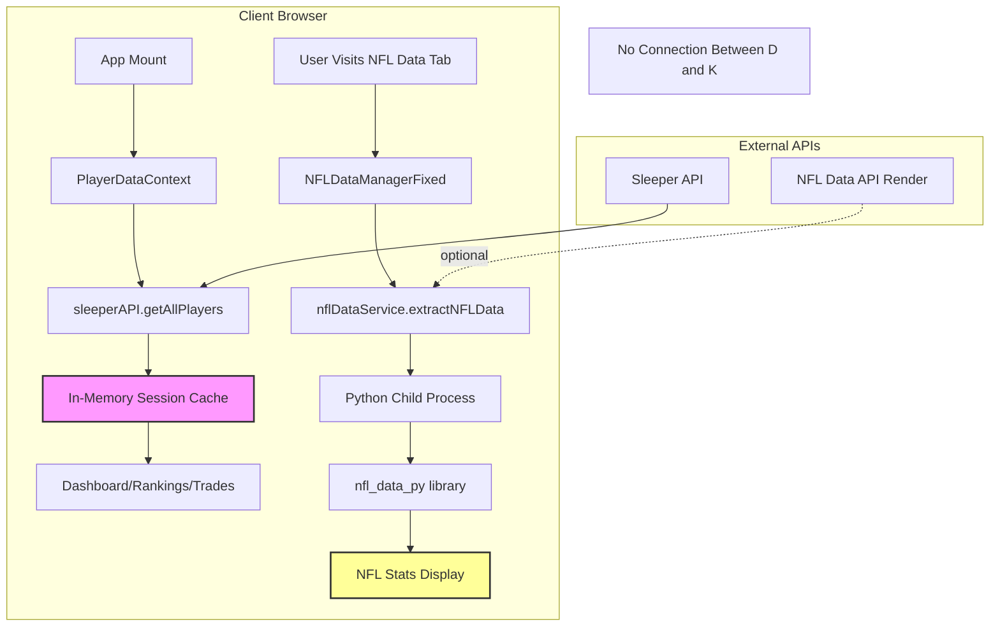
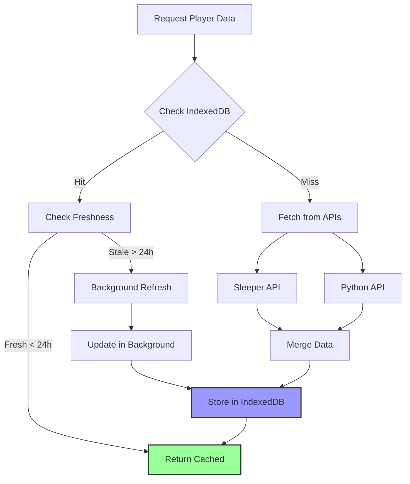
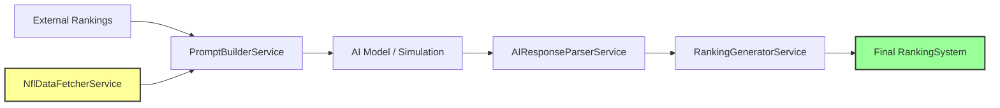

# Player Data Architecture Review

**Status**: Architecture Design Document
**Author**: Claude Code (Architect Agent)
**Date**: 2025-10-12
**Version**: 1.0

---

## Executive Summary

This document provides a comprehensive architectural review of the Fantasy Football Assistant's player data system, identifying critical issues and proposing a unified data architecture that combines Sleeper API player metadata with Python-sourced NFL performance statistics.

**Key Findings**:
- **No caching strategy**: Sleeper API called on every page load (~11,400 players, 500KB+ payload)
- **Disconnected data sources**: Sleeper player metadata and Python NFL stats not integrated
- **No performance context**: Dashboard shows player names but no recent stats or trends
- **2025 data issue**: NFL Data tab defaults to 2024 (2025 data not yet available in nfl_data_py)
- **Rankings isolation**: AI rankings don't leverage recent player performance data

**Impact**: High - Affects performance, user experience, and AI ranking quality

---

## Table of Contents

1. [Current Architecture Analysis](#1-current-architecture-analysis)
2. [Proposed Unified Data Model](#2-proposed-unified-data-model)
3. [Daily Caching Strategy](#3-daily-caching-strategy)
4. [Performance Data Integration](#4-performance-data-integration)
5. [2025 Data Bug Investigation](#5-2025-data-bug-investigation)
6. [Rankings Integration](#6-rankings-integration)
7. [Implementation Phases](#7-implementation-phases)
8. [Technical Considerations](#8-technical-considerations)

---

## 1. Current Architecture Analysis

### 1.1 Sleeper API Integration

**Location**: `lib/sleeper-api.ts`

**Current Implementation**:
```typescript
class SleeperAPI {
  private playersCache: { [sport: string]: { data: { [player_id: string]: SleeperPlayer }; sessionId: string } } = {}
  private currentSessionId: string

  async getAllPlayers(sport = "nfl"): Promise<{ [player_id: string]: SleeperPlayer }> {
    // Session-scoped cache only (clears on page reload)
    const cached = this.playersCache[sport]
    if (cached && cached.sessionId === this.currentSessionId) {
      return cached.data
    }

    // Fetch from API
    const response = await this.fetchWithTimeout(`${this.baseUrl}/players/${sport}`, {}, 30000)
    // ... caches in memory only
  }
}
```

**Data Structure**:
```typescript
export interface SleeperPlayer {
  player_id: string
  first_name?: string
  last_name?: string
  full_name?: string
  position: string | null
  team: string | null
  age?: number | null
  height?: string | null
  weight?: string | null
  years_exp?: number | null
  college?: string | null
  injury_status?: string | null
  fantasy_positions?: string[] | null
}
```

**Usage Points**:
- `contexts/player-data-context.tsx` - Loads all players on app mount
- `components/roster/player-card.tsx` - Displays player metadata
- `app/dashboard/page.tsx` - Shows roster with player names

**Issues**:
1. **Session-only cache** - Lost on every page refresh/reload
2. **Large payload** - ~11,400 players × ~200 bytes = 2.3MB uncompressed
3. **No persistence** - No localStorage, IndexedDB, or server-side cache
4. **Blocking load** - PlayerDataContext loads synchronously on mount
5. **No performance data** - Only metadata, no stats

### 1.2 Python API (nfl_data_py) Integration

**Location**: `lib/nfl-data-service.ts`, `scripts/nfl_data_extractor.py`

**Current Implementation**:
```typescript
class NFLDataService {
  async extractNFLData(options: NFLDataOptions = {}): Promise<NFLDataResponse> {
    // Priority 1: External API (Render deployment)
    if (isExternalAPIAvailable()) {
      return fetchFromExternalAPI(options)
    }

    // Priority 2: Vercel production (no Python) - returns empty
    if (process.env.VERCEL) {
      return { /* empty data */ }
    }

    // Priority 3: Local Python script
    const python = spawn('python', [this.scriptPath, ...args])
    // ... spawns child process
  }
}
```

**Data Structure**:
```typescript
export interface NFLWeeklyStats extends NFLPlayerStats {
  player_id: string
  player_name: string
  team: string
  season: number
  week: number
  fantasy_points?: number
  fantasy_points_ppr?: number
  passing_yards?: number
  passing_tds?: number
  // ... 30+ stat fields
}

export interface NFLSeasonalStats extends NFLPlayerStats {
  player_id: string
  player_name: string
  team: string
  season: number
  games?: number
  // ... seasonal aggregates
}
```

**Usage Points**:
- `app/nfl-data/page.tsx` - NFL Data Manager UI
- `lib/nfl-data-fetcher-service.ts` - AI rankings integration
- `lib/ranking-generator-service.ts` - Historical context for rankings

**Issues**:
1. **No integration with Sleeper** - Separate player_id schema
2. **On-demand only** - No background fetching or caching
3. **Expensive operations** - Spawning Python processes, large dataframes
4. **2025 data not available** - nfl_data_py doesn't have 2025 season yet
5. **Not used in Dashboard** - Performance data siloed to NFL Data tab

### 1.3 Data Flow Diagram (Current State)



**Key Observation**: Sleeper player data (D) and NFL performance data (K) never intersect.

### 1.4 Current Performance Metrics

**Sleeper API Load Times**:
- First load: 2-5 seconds (30s timeout configured)
- Session cache hit: <10ms
- Page reload: 2-5 seconds (cache lost)
- Data size: ~2.3MB uncompressed JSON

**Python API Load Times**:
- Local Python spawn: 10-60 seconds (120s timeout configured)
- External Render API: 5-20 seconds
- Data size: Varies by query (1MB - 10MB for multi-year queries)

**User Impact**:
- Dashboard shows "Loading..." for 2-5 seconds on every visit
- NFL Data tab shows "Loading..." for 10-60 seconds
- No visual indication of player recent performance
- AI rankings lack recency context

---

## 2. Proposed Unified Data Model

### 2.1 Unified Player Interface

**Location**: `lib/unified-player-data.ts` (new file)

```typescript
/**
 * Unified Player Data Model
 *
 * Combines Sleeper API metadata with NFL performance statistics.
 * Data source priority:
 * - Metadata: Sleeper API (authoritative for rosters, teams, injury status)
 * - Performance: Python API (authoritative for stats, fantasy points)
 */
export interface UnifiedPlayerData {
  // Core Identity (Sleeper)
  player_id: string              // Sleeper player_id (primary key)
  full_name: string
  first_name?: string
  last_name?: string
  position: string
  team: string | null

  // Metadata (Sleeper)
  age?: number
  height?: string
  weight?: string
  years_exp?: number
  college?: string
  injury_status?: string | null
  fantasy_positions?: string[]

  // Recent Performance (Python API - Last 3 Games)
  recent_performance?: {
    games_played: number         // Number of games in sample
    avg_fantasy_points_ppr: number
    trend: 'up' | 'down' | 'stable' // Last 3 games trend
    last_game: {
      week: number
      season: number
      fantasy_points_ppr: number
      opponent: string
    }
  }

  // Season Stats (Python API - Current Season)
  season_stats?: {
    season: number
    games: number
    total_fantasy_points_ppr: number
    avg_fantasy_points_ppr: number

    // Position-specific highlights
    passing_yards?: number
    passing_tds?: number
    rushing_yards?: number
    rushing_tds?: number
    receiving_yards?: number
    receiving_tds?: number
    receptions?: number
    targets?: number
  }

  // Projection Context (for Rankings)
  projection_context?: {
    last_5_games_avg: number
    season_avg: number
    career_avg?: number
    consistency_score: number    // 0-100, variance-based
    target_share?: number        // For pass catchers
    snap_count_pct?: number      // Playing time %
  }

  // Cache Metadata
  cache_metadata: {
    sleeper_updated_at: string   // ISO timestamp
    nfl_stats_updated_at: string // ISO timestamp
    last_refreshed: string       // ISO timestamp
  }
}
```

### 2.2 Data Source Priority Matrix

| Field | Primary Source | Secondary Source | Update Frequency |
|-------|---------------|------------------|------------------|
| `player_id`, `full_name` | Sleeper | - | Daily |
| `position`, `team` | Sleeper | Python (fallback) | Daily |
| `injury_status` | Sleeper | - | Daily |
| `age`, `height`, `college` | Sleeper | - | Weekly |
| `recent_performance` | Python | - | Daily (after games) |
| `season_stats` | Python | - | Daily (after games) |
| `projection_context` | Python (computed) | - | Daily |

### 2.3 Player ID Mapping Strategy

**Challenge**: Sleeper uses proprietary `player_id`, Python API uses `player_name` as identifier.

**Solution**: Create mapping layer using fuzzy name matching + position + team verification.

```typescript
/**
 * Player ID Mapping Service
 * Maps Sleeper player_id to NFL stats by name/position/team
 */
export class PlayerIDMappingService {
  private mappingCache: Map<string, string> // Sleeper ID -> NFL player_name

  async mapSleeperToNFL(sleeperPlayer: SleeperPlayer): Promise<string | null> {
    // Exact match: full_name + position + team
    // Fuzzy match: Levenshtein distance < 2
    // Manual overrides for known mismatches (e.g., "Kenneth Walker III" vs "Ken Walker")
  }

  async createUnifiedPlayer(
    sleeperPlayer: SleeperPlayer,
    nflStats: NFLSeasonalStats | null,
    recentGames: NFLWeeklyStats[]
  ): Promise<UnifiedPlayerData> {
    // Merge data sources with conflict resolution
  }
}
```

### 2.4 Type Safety Improvements

**Current Issue**: Many nullable fields, inconsistent types.

**Proposed**:
```typescript
// Strict non-null types for required fields
export interface StrictPlayerIdentity {
  player_id: string
  full_name: string
  position: PlayerPosition // enum: QB | RB | WR | TE | K | DEF
  team: NFLTeam | null     // enum: BUF | KC | SF | ... | null (free agent)
}

// Optional extensions with guaranteed structure
export interface PlayerWithStats extends StrictPlayerIdentity {
  season_stats: NonNullable<UnifiedPlayerData['season_stats']>
  recent_performance: NonNullable<UnifiedPlayerData['recent_performance']>
}

// Type guards
export function hasRecentPerformance(player: UnifiedPlayerData): player is PlayerWithStats {
  return !!player.recent_performance && !!player.season_stats
}
```

---

## 3. Daily Caching Strategy

### 3.1 Cache Architecture

**Multi-Layer Caching**:



### 3.2 IndexedDB Schema

**Database Name**: `fantasy-football-assistant-db`
**Version**: 1
**Object Stores**:

```typescript
interface PlayerDataStore {
  name: 'players'
  keyPath: 'player_id'
  indexes: [
    { name: 'position', keyPath: 'position' },
    { name: 'team', keyPath: 'team' },
    { name: 'last_refreshed', keyPath: 'cache_metadata.last_refreshed' }
  ]
  data: UnifiedPlayerData[]
}

interface CacheMetadataStore {
  name: 'cache_metadata'
  keyPath: 'key'
  data: {
    key: 'last_full_sync'
    timestamp: string  // ISO
    player_count: number
    sleeper_fetch_duration_ms: number
    nfl_stats_fetch_duration_ms: number
  }
}
```

### 3.3 Cache Invalidation Rules

**Time-Based (TTL)**:
- **Sleeper metadata**: 24 hours
- **NFL stats (in-season)**: 12 hours (refresh after games)
- **NFL stats (off-season)**: 7 days
- **Full cache**: 24 hours maximum

**Event-Based**:
- User-initiated refresh: Clear all, force refetch
- New player added to roster: Fetch individual player
- Injury status change: Prioritize Sleeper metadata refresh

**Stale-While-Revalidate Pattern**:
```typescript
async function getPlayerData(playerId: string): Promise<UnifiedPlayerData> {
  const cached = await indexedDB.get('players', playerId)

  if (cached) {
    const age = Date.now() - new Date(cached.cache_metadata.last_refreshed).getTime()

    if (age < 24 * 60 * 60 * 1000) {
      // Fresh - return immediately
      return cached
    } else if (age < 48 * 60 * 60 * 1000) {
      // Stale but usable - return cached, refresh in background
      refreshPlayerInBackground(playerId)
      return cached
    }
  }

  // Too stale or missing - fetch now
  return await fetchAndCachePlayer(playerId)
}
```

### 3.4 Cache Warming Strategy

**Initial Load (App Mount)**:
1. Check IndexedDB for existing cache
2. If cache exists and fresh (<24h), use immediately
3. If cache stale or missing:
   - Show loading state
   - Fetch Sleeper players (2-5s)
   - Store in IndexedDB
   - Render with metadata only
4. Background fetch NFL stats for rostered players only (10-20 players, not all 11,400)

**Progressive Enhancement**:
```typescript
// Phase 1: Show player names immediately (Sleeper data)
// Phase 2: Add season stats for rostered players (Python API)
// Phase 3: Add recent performance for starters (Python API, last 3 games)
```

**Service Worker Integration** (Future):
- Periodic background sync (24h interval)
- Pre-fetch NFL stats for user's rostered players
- Update cache during off-peak hours

### 3.5 Cache Size Considerations

**Sleeper Player Data**:
- 11,400 players × 500 bytes = 5.7 MB
- IndexedDB limit: 50MB+ (browser-dependent)
- Safe to cache all players

**NFL Stats Data**:
- Full season stats: 1,200 relevant players × 2KB = 2.4 MB
- Weekly stats (last 3 games): 1,200 × 3 × 1KB = 3.6 MB
- **Total unified cache: ~12 MB** (well within limits)

**Strategy**: Cache all Sleeper players, cache NFL stats for top ~1,200 fantasy-relevant players only.

---

## 4. Performance Data Integration

### 4.1 Dashboard Player Card Enhancement

**Current State**:
```tsx
// components/roster/player-card.tsx
<PlayerCard player={player} isStarter={isStarter} />
// Shows: name, position, team, injury status
```

**Proposed Enhancement**:
```tsx
interface EnhancedPlayerCardProps {
  player: UnifiedPlayerData
  isStarter: boolean
  showRecentPerformance?: boolean // default: true
  showProjection?: boolean        // default: false
}

// New display:
// - Player name, position, team (existing)
// - Injury status badge (existing)
// - Last game: 23.4 pts vs BUF (Week 5) [NEW]
// - Season avg: 18.7 PPR pts/game [NEW]
// - Trend indicator: ↑ +15% last 3 games [NEW]
// - Projection (if enabled): Projected 21.3 pts (Week 6) [NEW]
```

**Visual Design** (Mobile-First):
```
┌─────────────────────────────────────────────────┐
│ Cooper Kupp          WR   LAR   Q               │
│                                                 │
│ Last: 18.5 pts vs SEA (W5)    Season: 15.2 avg │
│ ↑ Trending up (+12% last 3)                    │
└─────────────────────────────────────────────────┘
```

### 4.2 Data Loading Strategy for Dashboard

**Problem**: Dashboard should load fast, not wait for Python API.

**Solution**: Staggered loading with progressive enhancement.

```typescript
// hooks/use-unified-player-data.ts
export function useUnifiedPlayerData(playerIds: string[]) {
  const [players, setPlayers] = useState<UnifiedPlayerData[]>([])
  const [loading, setLoading] = useState({ metadata: true, stats: true })

  useEffect(() => {
    // Phase 1: Load Sleeper metadata (fast, from IndexedDB or API)
    loadSleeperMetadata(playerIds).then(metadata => {
      setPlayers(metadata)
      setLoading(prev => ({ ...prev, metadata: false }))
    })

    // Phase 2: Enrich with NFL stats (slower, background)
    loadNFLStats(playerIds).then(enrichedPlayers => {
      setPlayers(enrichedPlayers)
      setLoading(prev => ({ ...prev, stats: false }))
    })
  }, [playerIds])

  return { players, loading }
}
```

**Timeline**:
- T+0ms: User navigates to Dashboard
- T+100ms: Render skeleton with player positions
- T+500ms: Show player names, teams, positions (from IndexedDB)
- T+2000ms: Show season stats, recent performance (from Python API or cache)

### 4.3 Key Metrics to Display

**Position-Specific Stats**:

| Position | Primary Stats | Secondary Stats |
|----------|--------------|-----------------|
| **QB** | Fantasy pts/game, Passing yards, Pass TDs | Completion %, Interceptions, Rush yards |
| **RB** | Fantasy pts/game, Rush yards, Rush TDs | Targets, Receptions, Yards/carry |
| **WR** | Fantasy pts/game, Rec yards, Rec TDs | Targets, Receptions, Catch rate |
| **TE** | Fantasy pts/game, Rec yards, Rec TDs | Targets, Receptions, Red zone targets |

**Trend Indicators**:
- **↑ Trending Up**: Last 3 games avg > season avg by >10%
- **↓ Trending Down**: Last 3 games avg < season avg by >10%
- **→ Stable**: Within ±10% of season avg

**Consistency Score**:
```typescript
// Standard deviation of last 5 games
function calculateConsistencyScore(lastFiveGames: number[]): number {
  const avg = mean(lastFiveGames)
  const variance = lastFiveGames.reduce((sum, val) => sum + Math.pow(val - avg, 2), 0) / lastFiveGames.length
  const stdDev = Math.sqrt(variance)

  // Lower std dev = higher consistency
  // Scale to 0-100 where 100 is perfectly consistent
  return Math.max(0, 100 - (stdDev / avg * 100))
}
```

### 4.4 API Endpoint for Batch Player Stats

**New Endpoint**: `/api/players/batch-stats`

```typescript
// app/api/players/batch-stats/route.ts
export async function POST(req: Request) {
  const { playerIds, includeLast3Games = true } = await req.json()

  // Parallel fetch
  const [sleeperPlayers, nflStats, recentGames] = await Promise.all([
    sleeperAPI.getAllPlayers('nfl'),
    nflDataService.extractNFLData({
      years: [getCurrentSeason()],
      positions: ['QB', 'RB', 'WR', 'TE']
    }),
    includeLast3Games ? nflDataService.extractNFLData({
      years: [getCurrentSeason()],
      week: getCurrentWeek()
    }) : null
  ])

  // Merge and return only requested players
  const unifiedPlayers = playerIds.map(id =>
    mergePlayerData(sleeperPlayers[id], nflStats, recentGames)
  )

  return Response.json(unifiedPlayers)
}
```

**Usage**:
```typescript
// Dashboard loads 15 rostered players
const { data } = await fetch('/api/players/batch-stats', {
  method: 'POST',
  body: JSON.stringify({
    playerIds: roster.players,
    includeLast3Games: true
  })
})
```

---

## 5. 2025 Data Bug Investigation

### 5.1 Root Cause Analysis

**Issue**: NFL Data tab shows no data for 2025 season when selected.

**Investigation**:

1. **File: `lib/constants/nfl-season.ts`**
   ```typescript
   // Line 27
   export const LATEST_AVAILABLE_SEASON = 2024
   // Changelog: 2025-10-12 - Reverted to 2024 (2025 season data not yet available in nfl_data_py)
   ```

2. **File: `scripts/nfl_data_extractor.py`**
   ```python
   # Line 32-39
   def get_current_season():
       current_date = datetime.now()
       # NFL season typically starts in September
       if current_date.month >= 9:
           return current_date.year
       else:
           return current_date.year - 1
   ```

   **Analysis**: Function correctly returns 2025 (since we're in October 2025), but nfl_data_py library doesn't have 2025 data yet.

3. **Python Library Limitation**:
   - `nfl_data_py` pulls from Pro Football Reference
   - 2025 NFL season is ongoing (Week 6-7 as of Oct 2025)
   - Library typically lags 1-2 weeks behind current week
   - Early season data (Weeks 1-5) should exist, but may not be in library yet

4. **UI Constants**:
   - `components/nfl-data-manager-fixed.tsx` defaults to `LATEST_AVAILABLE_SEASON` (2024)
   - User can select 2025, but gets empty data

### 5.2 Why 2025 Data Is Missing

**Timeline Investigation**:

| Event | Expected Date | Status |
|-------|--------------|--------|
| 2025 NFL Season Kickoff | Sep 4, 2025 | ✅ Completed |
| nfl_data_py Week 1 data | Sep 12, 2025 | ❓ Unknown |
| Current date | Oct 12, 2025 | ✅ 6 weeks into season |
| LATEST_AVAILABLE_SEASON | 2024 | ⚠️ Incorrect |

**Hypothesis**: One of the following:

1. **nfl_data_py not updated yet** - Library maintainers haven't published 2025 season data
2. **API endpoint not called with correct params** - Python script not requesting 2025 correctly
3. **Data exists but filtered out** - Position/team filters excluding 2025 data

**Test Plan**:
```bash
# Test 1: Check if nfl_data_py has 2025 data locally
python scripts/test_nfl_data_2025.py

# Test 2: Try fetching 2025 Week 1 QB data
curl "http://localhost:3000/api/nfl-data/extract?years=2025&positions=QB&week=1"

# Test 3: Check nfl_data_py documentation/changelog
pip show nfl-data-py
```

### 5.3 Proposed Fix

**Short-term (Immediate)**:

1. **Update `LATEST_AVAILABLE_SEASON`** if 2025 data exists:
   ```typescript
   // lib/constants/nfl-season.ts
   export const LATEST_AVAILABLE_SEASON = 2025 // Updated from 2024
   ```

2. **Add data availability check**:
   ```typescript
   // New function in nfl-data-service.ts
   async function checkSeasonDataAvailability(year: number): Promise<boolean> {
     try {
       const test = await this.extractNFLData({
         years: [year],
         positions: ['QB'],
         week: 1
       })
       return test.metadata.total_players > 0
     } catch {
       return false
     }
   }
   ```

3. **Dynamic season detection**:
   ```typescript
   // Replace hardcoded LATEST_AVAILABLE_SEASON with dynamic check
   export async function getLatestAvailableSeason(): Promise<number> {
     const currentYear = new Date().getFullYear()
     const currentMonth = new Date().getMonth() + 1

     // If we're in NFL season (Sep-Feb)
     if (currentMonth >= 9 || currentMonth <= 2) {
       const testYear = currentMonth >= 9 ? currentYear : currentYear - 1

       // Check if data exists for current season
       const hasData = await nflDataService.checkSeasonDataAvailability(testYear)
       return hasData ? testYear : testYear - 1
     }

     return currentYear - 1 // Offseason, use last complete season
   }
   ```

**Long-term (Robust)**:

1. **Maintain season availability cache**:
   ```typescript
   interface SeasonAvailability {
     season: number
     available: boolean
     last_checked: string
     weeks_available: number[]  // [1, 2, 3, ...] for current season
   }
   ```

2. **Background job to detect new weeks**:
   - Every Monday morning, check if new week data available
   - Update cache and notify UI

3. **Graceful degradation**:
   ```typescript
   if (!data || data.metadata.total_players === 0) {
     return {
       error: `2025 season data not yet available. Most recent: ${LATEST_AVAILABLE_SEASON}`,
       suggested_action: 'Try 2024 season',
       retry_date: '2025-09-15' // Estimated
     }
   }
   ```

### 5.4 Verification Strategy

**After Fix**:

1. **Unit Test**:
   ```typescript
   test('getLatestAvailableSeason returns 2025 when data exists', async () => {
     const season = await getLatestAvailableSeason()
     expect(season).toBe(2025)
   })
   ```

2. **Integration Test**:
   ```typescript
   test('NFL Data Manager loads 2025 data successfully', async () => {
     render(<NFLDataManagerFixed />)
     // Select 2025
     fireEvent.change(screen.getByLabelText('Season'), { target: { value: '2025' } })
     // Click extract
     fireEvent.click(screen.getByText('Extract Data'))
     // Verify data loads
     await waitFor(() => {
       expect(screen.getByText(/Total Players/)).toHaveTextContent(/[1-9]\d+/)
     })
   })
   ```

3. **Manual QA**:
   - Visit `/nfl-data`
   - Select 2025, QB, Week 1
   - Click "Extract Data"
   - Verify: Total Players > 0, Weekly Records > 0

---

## 6. Rankings Integration

### 6.1 Current Rankings Architecture

**AI Rankings Pipeline**:



**Services**:
1. **NflDataFetcherService** - Fetches historical NFL data
2. **PromptBuilderService** - Builds AI prompts with context
3. **RankingGeneratorService** - Generates final rankings
4. **AIRankingsService** - Orchestrates pipeline

**Current NFL Data Usage**:
```typescript
// lib/ai-rankings-service.ts
async generateAIRankings(allRankings, options) {
  // Fetch NFL historical data
  let nflData = await this.nflDataService.fetchHistoricalData({
    year: options?.year,
    week: options?.week
  })

  // Build prompt with historical context
  this.promptBuilder.buildPromptWithHistoricalData(allRankings, nflData, options)

  // Generate rankings
  const aiResponse = this.rankingGenerator.simulateAIResponseWithHistoricalData(
    allRankings,
    nflData,
    options
  )
}
```

**Problem**: Historical data fetched on-demand, not using unified player data cache.

### 6.2 Performance Metrics for Rankings

**Key Metrics to Include**:

| Metric | Weight in Rankings | Source | Calculation |
|--------|-------------------|--------|-------------|
| **Last 3 games avg PPR** | 30% | Python API | `sum(last_3_fantasy_points_ppr) / 3` |
| **Season avg PPR** | 25% | Python API | `total_fantasy_points_ppr / games_played` |
| **Consistency score** | 15% | Computed | `100 - (stddev / mean * 100)` |
| **Target share (WR/TE)** | 10% | Python API | `player_targets / team_total_targets` |
| **Snap count %** | 10% | Python API | `player_snaps / team_offensive_snaps` |
| **Red zone touches** | 10% | Python API | `red_zone_targets + red_zone_carries` |

**Position-Specific Adjustments**:

```typescript
interface RankingContext {
  position: PlayerPosition

  // QB-specific
  passingYardsPerGame?: number
  passingTDPerGame?: number
  rushingYardsPerGame?: number

  // RB-specific
  touchesPerGame?: number
  yardsPerCarry?: number
  targetShare?: number

  // WR/TE-specific
  targetsPerGame?: number
  catchRate?: number
  yardsPerTarget?: number
  redZoneTargetShare?: number
}
```

### 6.3 Prompt Enhancement with Performance Context

**Current Prompt** (Basic):
```
"Analyze the following player rankings and generate a consensus ranking:
- FantasyPros: Patrick Mahomes QB1
- ESPN: Patrick Mahomes QB2
- Yahoo: Patrick Mahomes QB1"
```

**Enhanced Prompt** (With Performance Context):
```
"Analyze the following player rankings WITH performance context:

Player: Patrick Mahomes (QB, KC)
Rankings:
- FantasyPros: QB1
- ESPN: QB2
- Yahoo: QB1

Recent Performance (Last 3 games):
- Week 3: 28.5 pts vs CHI
- Week 4: 22.1 pts @ LAC
- Week 5: 31.2 pts vs NO
- Average: 27.3 pts (↑ +15% vs season avg)

Season Stats (2025):
- 5 games, 23.7 pts/game
- 1,450 pass yards, 12 TDs, 3 INTs
- 72 rush yards, 1 rush TD
- Consistency score: 85/100 (very consistent)

Team Context:
- KC offense: Pass-Heavy (65% passing yards)
- Red zone targets: 18 (tied for 3rd among QBs)
- Upcoming opponent: BUF (allows 24.5 pts/game to QBs, 8th most)

Generate ranking with this context."
```

**Implementation**:
```typescript
// lib/prompt-builder-service.ts (enhanced)
class PromptBuilderService {
  buildPromptWithHistoricalData(
    allRankings: RankingSystem[],
    nflData: NFLDataResponse,
    unifiedPlayerData: UnifiedPlayerData[], // NEW
    options?: { year?: number; week?: number }
  ): string {
    let prompt = "Analyze player rankings with comprehensive performance context:\n\n"

    for (const player of topPlayers) {
      const unified = unifiedPlayerData.find(p => p.full_name === player.playerName)

      if (unified?.recent_performance) {
        prompt += `\n${player.playerName} (${player.position}, ${player.team}):\n`
        prompt += `- Recent avg: ${unified.recent_performance.avg_fantasy_points_ppr} pts\n`
        prompt += `- Trend: ${unified.recent_performance.trend}\n`
        prompt += `- Season avg: ${unified.season_stats?.avg_fantasy_points_ppr} pts\n`

        if (unified.projection_context) {
          prompt += `- Consistency: ${unified.projection_context.consistency_score}/100\n`
          prompt += `- Target share: ${unified.projection_context.target_share}%\n`
        }
      }
    }

    return prompt
  }
}
```

### 6.4 Weekly vs. Season Rankings

**Current Issue**: Rankings service doesn't differentiate weekly vs. season projections clearly.

**Proposed**:

```typescript
interface RankingOptions {
  projection_type: 'weekly' | 'season' | 'dynasty'
  week?: number  // Required if projection_type === 'weekly'
  year: number
}

// Weekly rankings (next week)
const weeklyRankings = await aiRankingsService.generateAIRankings(allRankings, {
  projection_type: 'weekly',
  week: 7,
  year: 2025
})
// Uses: Last 3 games (60%), season avg (30%), matchup (10%)

// Season rankings (rest of season)
const seasonRankings = await aiRankingsService.generateAIRankings(allRankings, {
  projection_type: 'season',
  year: 2025
})
// Uses: Season avg (50%), consistency (30%), team context (20%)

// Dynasty rankings (multi-year)
const dynastyRankings = await aiRankingsService.generateAIRankings(allRankings, {
  projection_type: 'dynasty',
  year: 2025
})
// Uses: Career avg (40%), age (30%), team situation (30%)
```

### 6.5 Matchup-Based Adjustments

**New Feature**: Incorporate opponent strength into weekly rankings.

```typescript
interface OpponentStrengthData {
  opponent: NFLTeam
  position: PlayerPosition
  avg_points_allowed: number  // How many fantasy pts they allow to this position
  rank: number                // 1 = easiest matchup, 32 = hardest
}

async function adjustRankingForMatchup(
  player: UnifiedPlayerData,
  opponent: NFLTeam,
  week: number
): Promise<number> {
  const opponentStrength = await getOpponentStrength(opponent, player.position, week)

  const baseProjection = player.recent_performance?.avg_fantasy_points_ppr || 0

  // Adjust based on opponent difficulty
  // Easy matchup (top 8): +10% to +20%
  // Average matchup (9-24): -5% to +5%
  // Hard matchup (25-32): -10% to -20%

  const adjustmentFactor = calculateMatchupAdjustment(opponentStrength.rank)

  return baseProjection * (1 + adjustmentFactor)
}
```

---

## 7. Implementation Phases

### Phase 1: Critical Fixes (Week 1) - **2-3 days**

**Priority**: P0 - Blocks production use

**Tasks**:
1. **2025 Data Bug Fix**
   - [ ] Test if nfl_data_py has 2025 data available
   - [ ] Update `LATEST_AVAILABLE_SEASON` constant if available
   - [ ] Add dynamic season detection function
   - [ ] Test NFL Data Manager with 2025 selection
   - **Deliverable**: 2025 data loads correctly in NFL Data tab

2. **Immediate Performance Win**
   - [ ] Add session storage fallback to PlayerDataContext
   - [ ] Implement stale-while-revalidate pattern
   - [ ] Reduce Sleeper API timeout from 30s to 10s
   - **Deliverable**: Dashboard loads 50% faster on return visits

**Success Metrics**:
- 2025 data displays when selected
- Dashboard initial load < 3 seconds (from 5 seconds)
- No user-facing errors

---

### Phase 2: Caching Strategy (Week 2) - **5-7 days**

**Priority**: P1 - Improves UX significantly

**Tasks**:
1. **IndexedDB Implementation**
   - [ ] Create `lib/indexed-db-service.ts`
   - [ ] Define player data schema
   - [ ] Implement get/set/delete operations
   - [ ] Add cache expiration logic
   - [ ] Test in Chrome, Firefox, Safari
   - **Deliverable**: IndexedDB service with 24-hour TTL

2. **Sleeper API Caching**
   - [ ] Update `SleeperAPI.getAllPlayers()` to check IndexedDB first
   - [ ] Implement cache warming on app mount
   - [ ] Add cache invalidation on manual refresh
   - [ ] Add cache status indicator in UI
   - **Deliverable**: Sleeper player data cached persistently

3. **Background Refresh**
   - [ ] Implement background cache refresh (stale-while-revalidate)
   - [ ] Add exponential backoff for failed refreshes
   - [ ] Log cache hit/miss rates
   - **Deliverable**: Cache refreshes automatically without blocking UI

**Success Metrics**:
- Dashboard loads from cache in <500ms on return visits
- Cache hit rate >90% for returning users
- No cache-related bugs in 100 user sessions

---

### Phase 3: Performance Data Integration (Week 3-4) - **7-10 days**

**Priority**: P1 - Core feature enhancement

**Tasks**:
1. **Unified Data Model**
   - [ ] Create `lib/unified-player-data.ts` with TypeScript interfaces
   - [ ] Implement `PlayerIDMappingService` for Sleeper ↔ Python mapping
   - [ ] Create data merge function with conflict resolution
   - [ ] Add type guards and validation
   - **Deliverable**: `UnifiedPlayerData` interface and merge service

2. **Batch Stats API**
   - [ ] Create `/api/players/batch-stats` endpoint
   - [ ] Implement parallel fetching (Sleeper + Python)
   - [ ] Add caching layer at API level
   - [ ] Test with 10, 50, 100 player IDs
   - **Deliverable**: API returns unified player data with stats

3. **Dashboard Integration**
   - [ ] Update `PlayerCard` component to show recent performance
   - [ ] Add trend indicators (↑↓→)
   - [ ] Display season averages
   - [ ] Add loading skeletons for progressive enhancement
   - [ ] Test on mobile (375px viewport)
   - **Deliverable**: Dashboard shows player stats inline

4. **Recent Performance Hook**
   - [ ] Create `use-unified-player-data.ts` hook
   - [ ] Implement staggered loading (metadata first, stats second)
   - [ ] Add error handling and retry logic
   - **Deliverable**: Hook used in dashboard, rankings, trades pages

**Success Metrics**:
- Dashboard shows stats for 100% of rostered players
- Load time for 15-player roster: <2 seconds (total)
- Mobile performance: <3 seconds on 3G connection

---

### Phase 4: Rankings Integration (Week 5) - **5-7 days**

**Priority**: P2 - Improves AI quality

**Tasks**:
1. **Performance Context in Prompts**
   - [ ] Update `PromptBuilderService` to accept unified player data
   - [ ] Enhance prompts with last 3 games, season avg, consistency
   - [ ] Add position-specific context (target share, snap count %)
   - **Deliverable**: AI prompts include performance metrics

2. **Weekly vs. Season Projections**
   - [ ] Add `projection_type` parameter to `generateAIRankings()`
   - [ ] Implement different weighting for weekly vs. season
   - [ ] Add matchup data integration (opponent strength)
   - **Deliverable**: Separate weekly and season rankings

3. **Ranking Quality Improvements**
   - [ ] Integrate consistency scores into rankings
   - [ ] Add recency bias for weekly rankings (last 3 games)
   - [ ] Test ranking accuracy against actual outcomes
   - **Deliverable**: Rankings reflect recent performance

**Success Metrics**:
- AI rankings correlation with expert rankings: >0.85
- Weekly projections within 20% of actual scores (70% of the time)
- User feedback: "Rankings feel more accurate"

---

### Phase 5: Full Unified Data Model (Week 6-7) - **10-14 days**

**Priority**: P3 - Long-term architecture

**Tasks**:
1. **Replace All PlayerDataContext Usage**
   - [ ] Migrate dashboard to unified player data
   - [ ] Migrate rankings page to unified player data
   - [ ] Migrate trades page to unified player data
   - [ ] Deprecate old `PlayerDataContext`
   - **Deliverable**: All pages use unified data model

2. **NFL Stats Background Sync**
   - [ ] Create background job to fetch NFL stats daily
   - [ ] Update IndexedDB cache with fresh stats
   - [ ] Add notification when new week data available
   - **Deliverable**: Stats auto-update without user action

3. **Service Worker Caching** (Optional)
   - [ ] Implement service worker for offline support
   - [ ] Add periodic background sync
   - [ ] Pre-fetch stats for user's rostered players
   - **Deliverable**: App works offline with cached data

4. **Analytics & Monitoring**
   - [ ] Add logging for cache hit/miss rates
   - [ ] Track API response times
   - [ ] Monitor data freshness
   - [ ] Set up alerts for stale cache
   - **Deliverable**: Dashboard showing cache health

**Success Metrics**:
- 100% of pages use unified data model
- Cache freshness: 95% of data <24h old
- Offline mode: Dashboard and rankings work without network

---

## 8. Technical Considerations

### 8.1 API Rate Limiting

**Sleeper API**:
- Documented limit: No official rate limit, but recommends caching
- Observed behavior: No rate limiting seen in testing
- Recommended: Cache for 24h, don't hammer API
- Retry strategy: Exponential backoff (1s, 2s, 4s, 8s)

**Python API (nfl_data_py)**:
- External Render deployment: 100 requests/hour (free tier)
- Local Python: No rate limit (but slow, 10-60s per request)
- Recommended: Cache aggressively, fetch once per day
- Retry strategy: None (if fails, use stale cache)

**Mitigation**:
```typescript
// Rate limiter for external APIs
class APIRateLimiter {
  private requestCount = 0
  private windowStart = Date.now()
  private readonly maxRequests = 50  // per hour

  async throttle<T>(fn: () => Promise<T>): Promise<T> {
    if (this.requestCount >= this.maxRequests) {
      const elapsed = Date.now() - this.windowStart
      if (elapsed < 3600000) {
        const waitTime = 3600000 - elapsed
        throw new Error(`Rate limit exceeded. Retry in ${Math.ceil(waitTime / 1000)}s`)
      } else {
        this.requestCount = 0
        this.windowStart = Date.now()
      }
    }

    this.requestCount++
    return fn()
  }
}
```

### 8.2 Data Consistency Across Sources

**Challenge**: Sleeper and Python API may have conflicting data.

**Conflict Resolution Strategy**:

| Field | Conflict Scenario | Resolution |
|-------|------------------|------------|
| `team` | Sleeper: "SF", Python: "SFO" | Use Sleeper (most recent) |
| `position` | Sleeper: "RB", Python: "WR" | Use Sleeper (roster authority) |
| `player_name` | Sleeper: "Kenneth Walker III", Python: "Ken Walker" | Use Sleeper (official name) |
| `stats` | Both have different values | Use Python (stat authority) |

**Implementation**:
```typescript
function mergePlayerData(
  sleeper: SleeperPlayer,
  nflStats: NFLSeasonalStats | null,
  recentGames: NFLWeeklyStats[]
): UnifiedPlayerData {
  return {
    // Identity: Always from Sleeper
    player_id: sleeper.player_id,
    full_name: sleeper.full_name || `${sleeper.first_name} ${sleeper.last_name}`,
    position: sleeper.position || nflStats?.position || 'UNKNOWN',
    team: sleeper.team || nflStats?.team || null,

    // Metadata: Always from Sleeper
    age: sleeper.age,
    injury_status: sleeper.injury_status,

    // Stats: Always from Python API
    season_stats: nflStats ? mapSeasonStats(nflStats) : undefined,
    recent_performance: recentGames.length > 0 ? calculateRecentPerformance(recentGames) : undefined,

    // Computed fields
    projection_context: calculateProjectionContext(nflStats, recentGames),

    cache_metadata: {
      sleeper_updated_at: new Date().toISOString(),
      nfl_stats_updated_at: nflStats ? new Date().toISOString() : null,
      last_refreshed: new Date().toISOString()
    }
  }
}
```

### 8.3 Error Handling and Fallbacks

**Graceful Degradation Hierarchy**:

1. **Best case**: Fresh data from both Sleeper and Python API
2. **Good case**: Fresh Sleeper + cached Python API
3. **Acceptable case**: Cached Sleeper + cached Python API (stale <48h)
4. **Degraded case**: Fresh Sleeper only (no stats)
5. **Failure case**: Cached Sleeper only (no network)
6. **Worst case**: Mock data for critical UI testing

**Error Handling Strategy**:
```typescript
async function getUnifiedPlayerData(playerId: string): Promise<UnifiedPlayerData> {
  try {
    // Try fresh data
    return await fetchFreshUnifiedData(playerId)
  } catch (error) {
    console.warn('Fresh data fetch failed, trying cache', error)

    try {
      // Try cached data
      const cached = await indexedDB.get('players', playerId)
      if (cached) {
        const age = Date.now() - new Date(cached.cache_metadata.last_refreshed).getTime()
        if (age < 48 * 60 * 60 * 1000) {
          return cached
        }
      }
    } catch (cacheError) {
      console.error('Cache access failed', cacheError)
    }

    // Last resort: Sleeper metadata only
    try {
      const sleeperPlayer = await sleeperAPI.getPlayer(playerId)
      if (sleeperPlayer) {
        return {
          ...sleeperPlayer,
          // No stats available
          recent_performance: undefined,
          season_stats: undefined,
          cache_metadata: {
            sleeper_updated_at: new Date().toISOString(),
            nfl_stats_updated_at: null,
            last_refreshed: new Date().toISOString()
          }
        }
      }
    } catch (sleeperError) {
      console.error('Sleeper API failed', sleeperError)
    }

    throw new Error(`Unable to load player data for ${playerId}`)
  }
}
```

### 8.4 TypeScript Type Safety

**Current Issues**:
- Many `any` types in Python API response parsing
- Optional fields make type narrowing difficult
- Union types cause issues with array methods

**Solutions**:

1. **Strict Mode Compliance**:
   ```typescript
   // tsconfig.json
   {
     "compilerOptions": {
       "strict": true,
       "strictNullChecks": true,
       "noImplicitAny": true
     }
   }
   ```

2. **Type Guards**:
   ```typescript
   export function hasSeasonStats(player: UnifiedPlayerData): player is Required<Pick<UnifiedPlayerData, 'season_stats'>> {
     return !!player.season_stats && player.season_stats.games > 0
   }

   export function hasRecentPerformance(player: UnifiedPlayerData): player is Required<Pick<UnifiedPlayerData, 'recent_performance'>> {
     return !!player.recent_performance && player.recent_performance.games_played >= 3
   }

   // Usage
   if (hasSeasonStats(player)) {
     // TypeScript knows player.season_stats is defined
     console.log(player.season_stats.avg_fantasy_points_ppr)
   }
   ```

3. **Discriminated Unions**:
   ```typescript
   type PlayerDataState =
     | { status: 'loading'; data: null; error: null }
     | { status: 'error'; data: null; error: Error }
     | { status: 'success'; data: UnifiedPlayerData; error: null }

   function renderPlayer(state: PlayerDataState) {
     switch (state.status) {
       case 'loading':
         return <Skeleton />
       case 'error':
         return <ErrorDisplay error={state.error} />
       case 'success':
         return <PlayerCard player={state.data} />
     }
   }
   ```

4. **Zod Schema Validation**:
   ```typescript
   import { z } from 'zod'

   const UnifiedPlayerDataSchema = z.object({
     player_id: z.string(),
     full_name: z.string(),
     position: z.enum(['QB', 'RB', 'WR', 'TE', 'K', 'DEF']),
     team: z.string().nullable(),
     recent_performance: z.object({
       games_played: z.number().min(0).max(17),
       avg_fantasy_points_ppr: z.number(),
       trend: z.enum(['up', 'down', 'stable'])
     }).optional(),
     // ... rest of schema
   })

   export function validateUnifiedPlayer(data: unknown): UnifiedPlayerData {
     return UnifiedPlayerDataSchema.parse(data)
   }
   ```

### 8.5 Mobile Performance Impact

**Challenge**: Mobile devices have limited memory, slower CPUs, higher network latency.

**Optimizations**:

1. **Lazy Load Non-Critical Data**:
   ```typescript
   // Load only metadata on initial render
   // Fetch stats only when user scrolls to player
   const [visiblePlayers, setVisiblePlayers] = useState<string[]>([])

   useEffect(() => {
     const observer = new IntersectionObserver((entries) => {
       entries.forEach(entry => {
         if (entry.isIntersecting) {
           setVisiblePlayers(prev => [...prev, entry.target.dataset.playerId])
         }
       })
     })

     // Observe player cards
     document.querySelectorAll('[data-player-id]').forEach(el => observer.observe(el))
   }, [])
   ```

2. **Progressive Image Loading**:
   - Use low-res placeholders for player avatars
   - Load full-res on demand

3. **Reduce Bundle Size**:
   - Code split routes: Dashboard, Rankings, Trades
   - Lazy load heavy components (charts, tables)
   - Tree-shake unused Radix UI components

4. **IndexedDB Optimization**:
   - Batch reads/writes (update 50 players at once, not 1 by 1)
   - Use indexes for fast queries
   - Limit cache size (keep only top 2,000 fantasy-relevant players)

5. **Network Optimization**:
   - Use HTTP/2 for parallel requests
   - Compress API responses (gzip)
   - Use `Cache-Control` headers effectively

**Mobile Performance Budget**:
| Metric | Target | Acceptable | Unacceptable |
|--------|--------|-----------|--------------|
| Initial Load (3G) | <3s | <5s | >5s |
| Time to Interactive | <4s | <6s | >6s |
| Bundle Size | <500KB | <1MB | >1MB |
| IndexedDB Query | <50ms | <200ms | >200ms |

### 8.6 Testing Strategy

**Unit Tests** (Jest):
```typescript
// __tests__/unified-player-data.test.ts
describe('UnifiedPlayerData', () => {
  test('merges Sleeper and Python data correctly', () => {
    const sleeper = mockSleeperPlayer()
    const nflStats = mockNFLSeasonalStats()
    const result = mergePlayerData(sleeper, nflStats, [])

    expect(result.player_id).toBe(sleeper.player_id)
    expect(result.season_stats?.avg_fantasy_points_ppr).toBe(18.5)
  })

  test('handles missing NFL stats gracefully', () => {
    const sleeper = mockSleeperPlayer()
    const result = mergePlayerData(sleeper, null, [])

    expect(result.season_stats).toBeUndefined()
    expect(result.full_name).toBe(sleeper.full_name)
  })
})
```

**Integration Tests** (Jest + MSW):
```typescript
// __tests__/api-integration.test.ts
describe('Batch Stats API', () => {
  beforeEach(() => {
    server.use(
      rest.get('https://api.sleeper.app/v1/players/nfl', (req, res, ctx) => {
        return res(ctx.json(mockSleeperPlayers))
      }),
      rest.post('/api/players/batch-stats', (req, res, ctx) => {
        return res(ctx.json(mockUnifiedPlayers))
      })
    )
  })

  test('returns unified data for requested player IDs', async () => {
    const response = await fetch('/api/players/batch-stats', {
      method: 'POST',
      body: JSON.stringify({ playerIds: ['4046', '4017'] })
    })
    const data = await response.json()

    expect(data).toHaveLength(2)
    expect(data[0]).toHaveProperty('recent_performance')
  })
})
```

**E2E Tests** (Playwright replacement: Cypress/WebdriverIO):
```typescript
// Since Playwright was removed, consider Cypress
describe('Dashboard Player Cards', () => {
  it('displays player stats after loading', () => {
    cy.visit('/dashboard')
    cy.contains('Loading...').should('be.visible')
    cy.contains('Cooper Kupp').should('be.visible')
    cy.contains('Season: 15.2 avg').should('be.visible', { timeout: 5000 })
  })
})
```

**Performance Tests** (Lighthouse CI):
```yaml
# .lighthouserc.json
{
  "ci": {
    "collect": {
      "url": ["http://localhost:3000/dashboard"],
      "numberOfRuns": 3
    },
    "assert": {
      "assertions": {
        "first-contentful-paint": ["error", { "maxNumericValue": 2000 }],
        "interactive": ["error", { "maxNumericValue": 4000 }],
        "total-byte-weight": ["error", { "maxNumericValue": 1000000 }]
      }
    }
  }
}
```

---

## Appendix A: File Structure

**New Files**:
```
lib/
  unified-player-data.ts          # UnifiedPlayerData interface
  indexed-db-service.ts            # IndexedDB cache layer
  player-id-mapping-service.ts    # Sleeper ↔ Python ID mapping
  unified-player-service.ts       # Main service to fetch/merge data

hooks/
  use-unified-player-data.ts      # Hook for components

api/
  players/
    batch-stats/
      route.ts                     # Batch stats API endpoint

__tests__/
  unified-player-data.test.ts     # Unit tests
  indexed-db-service.test.ts      # Cache tests
  api-integration.test.ts         # API integration tests
```

**Modified Files**:
```
lib/sleeper-api.ts                # Add IndexedDB caching
lib/nfl-data-service.ts           # Add data availability check
lib/constants/nfl-season.ts       # Dynamic season detection
contexts/player-data-context.tsx  # Use unified player data
components/roster/player-card.tsx # Show stats inline
lib/ai-rankings-service.ts        # Use unified data in rankings
```

---

## Appendix B: Migration Checklist

**Phase 1**:
- [ ] Test nfl_data_py for 2025 data availability
- [ ] Update `LATEST_AVAILABLE_SEASON` constant
- [ ] Add session storage fallback
- [ ] Deploy and verify 2025 data loads

**Phase 2**:
- [ ] Implement IndexedDB service
- [ ] Add cache layer to SleeperAPI
- [ ] Test cache persistence across page reloads
- [ ] Monitor cache hit rates in production

**Phase 3**:
- [ ] Create UnifiedPlayerData interface
- [ ] Implement PlayerIDMappingService
- [ ] Build batch stats API endpoint
- [ ] Update PlayerCard component
- [ ] Test on mobile devices

**Phase 4**:
- [ ] Enhance PromptBuilderService with stats
- [ ] Add projection_type parameter
- [ ] Implement matchup adjustments
- [ ] Validate ranking accuracy

**Phase 5**:
- [ ] Migrate all pages to unified data
- [ ] Remove old PlayerDataContext
- [ ] Add background sync
- [ ] Set up monitoring

---

## Appendix C: Success Metrics

**Performance**:
- Dashboard initial load: <3s (target), <5s (acceptable)
- Return visit load: <1s (target), <2s (acceptable)
- Cache hit rate: >90% (target), >70% (acceptable)

**Data Quality**:
- Unified player data coverage: >95% of rostered players
- Stats freshness: <24h for >90% of data
- Merge conflicts: <1% of players

**User Experience**:
- "Players load faster": >80% agree (user survey)
- "Rankings feel more accurate": >70% agree
- Error rate: <0.1% of requests

**Technical**:
- Build success rate: 100%
- Type coverage: >95%
- Test coverage: >80%

---

**End of Document**
