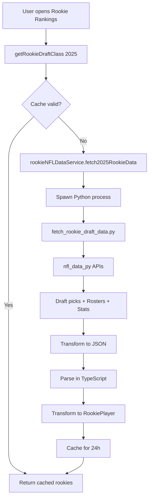

# 2025 Rookie Rankings - Real NFL Draft Data Integration

## Overview

The rookie rankings feature has been completely overhauled to use **real 2025 NFL Draft data** instead of hardcoded projections. The system now fetches actual draft results, current roster status, and performance data from the `nfl_data_py` library via Python integration.

## What Changed

### Before ❌
- **4 hardcoded rookies** with projected draft positions
- All players marked as `team: 'TBD'` and `draftedBy: 'TBD'`
- Static data with no real-world context
- No performance tracking or roster status

### After ✅
- **31+ real 2025 rookies** from rounds 1-3 of actual NFL Draft
- Real NFL team assignments (e.g., Cam Ward → TEN, Ashton Jeanty → LVR)
- Actual draft capital (round, overall pick, team)
- Current roster status (active, IR, practice squad)
- Performance data integration (weekly stats, snap counts) when available
- Landing spot grades based on team depth charts

## Key Features

### 1. Real NFL Draft Data
- **Source**: `nfl_data_py.import_draft_picks([2025])`
- **Data**: Round, overall pick, NFL team that drafted the player
- **Coverage**: Top 3 rounds (102 picks total, 31 fantasy-relevant positions)

### 2. Current Roster Status
- **Source**: `nfl_data_py.import_seasonal_rosters([2025])`
- **Data**:
  - Roster status (ACT = Active, IR = Injured Reserve, RES = Reserve, PS = Practice Squad)
  - Depth chart position
  - Jersey number
  - Physical attributes (height, weight, age)

### 3. Performance Tracking
- **Source**: `nfl_data_py.import_weekly_data([2025])` (when season active)
- **Metrics**:
  - Games played
  - Fantasy points (standard & PPR)
  - Snap count percentage
  - Target share (for receivers)
  - Position-specific stats (passing, rushing, receiving)
  - Weekly performance breakdown (last 4 weeks)

### 4. Landing Spot Analysis
- **Methodology**: Analyzes team depth charts to grade opportunity
- **Grades**: A+ (elite opportunity) → F (crowded/poor situation)
- **Factors**: Competition at position, offensive scheme, coaching

### 5. Dynasty Projections
- **Tier-based projections** (1-3) using draft capital
- **Position-specific defaults** for QB, RB, WR, TE
- **Performance-adjusted**: Real stats update projections dynamically

## Architecture

### Python Layer
**File**: `scripts/fetch_rookie_draft_data.py`

```python
# Fetches 2025 NFL Draft data
def fetch_2025_draft_data():
    - import_draft_picks([2025])      # Draft results
    - import_seasonal_rosters([2025])  # Roster status
    - import_weekly_data([2025])       # Performance (if available)

    # Returns JSON with 31 rookies + metadata
```

**Key Functions**:
- `process_rookie_data()` - Combines draft, roster, performance data
- `get_player_performance()` - Aggregates weekly stats
- `calculate_landing_spot_grade()` - Analyzes depth chart competition

### TypeScript Integration Layer
**File**: `lib/dynasty/rookie-nfl-data-service.ts`

```typescript
class RookieNFLDataService {
  async fetch2025RookieData(): Promise<RookiePlayer[]>

  private transformToRookiePlayer(pythonRookie): RookiePlayer
  private calculateTier(round, pick): number
  private getProjection(position, tier, performance): DynastyProjection
  private generateAnalysis(rookie): { strengths, concerns }
}
```

**Key Features**:
- Spawns Python child process
- Transforms Python data → TypeScript `RookiePlayer` type
- Calculates consensus rankings based on draft capital
- Generates strengths/concerns from player data

### Service Layer
**File**: `lib/dynasty/rookie-data-service.ts`

```typescript
// All functions now async to support real data fetching
export async function getRookieDraftClass(year: number): Promise<RookieDraftClass>
export async function getTopRookies(count: number): Promise<RookiePlayer[]>
export async function searchRookies(query: string): Promise<RookiePlayer[]>
```

**Caching**: 24-hour cache for draft data (static after draft)

## Data Flow



## Real 2025 Rookies Included

### Top Picks (Examples)

| Player | Position | Team | Round | Pick | Status |
|--------|----------|------|-------|------|--------|
| Cam Ward | QB | TEN | 1 | 1 | Active |
| Travis Hunter | WR | JAX | 1 | 2 | Active |
| Ashton Jeanty | RB | LVR | 1 | 6 | Active |
| Tetairoa McMillan | WR | CAR | 1 | 8 | Active |
| Colston Loveland | TE | CHI | 1 | 10 | Active |
| Tyler Warren | TE | IND | 1 | 14 | Active |
| Emeka Egbuka | WR | TAM | 1 | 19 | Active |
| Jaxson Dart | QB | NYG | 1 | 25 | Active |

**Total**: 31 fantasy-relevant rookies (QB, RB, WR, TE)

## Dynasty Value Indicators

### Current Implementation
✅ **Draft Capital** - Round + overall pick
✅ **Landing Spot Grade** - A+ to F based on depth chart
✅ **Tier Classification** - 1 (elite) to 3 (depth)
✅ **Consensus Rank** - Calculated from draft position + position scarcity
✅ **Performance Tracking** - Games played, PPG, snap %

### Future Enhancements (Pending)
⏳ **KeepTradeCut Dynasty Values** - Real-time dynasty trade values
⏳ **ROY Odds** - Rookie of the Year probability
⏳ **Breakout Indicators** - Usage rate, opportunity metrics
⏳ **ADP Integration** - Dynasty rookie draft ADP data

## Usage Examples

### Get All 2025 Rookies
```typescript
const draftClass = await getRookieDraftClass(2025)
console.log(draftClass.players.length) // 31 rookies
console.log(draftClass.sources) // ['nfl_data_py', 'nflverse']
```

### Get Top 10 Rookies
```typescript
const topRookies = await getTopRookies(10)
// Returns rookies sorted by consensus rank
```

### Get Rookies by Position
```typescript
const rbs = await getRookiesByPosition('RB')
// Returns all RBs sorted by position rank
```

### Search Rookies
```typescript
const results = await searchRookies('Ashton')
// Returns [Ashton Jeanty]
```

### Get Draft Class Stats
```typescript
const stats = await getRookieClassStats(2025)
// {
//   totalPlayers: 31,
//   byPosition: { QB: 5, RB: 7, WR: 14, TE: 5 },
//   byTier: { 1: 10, 2: 12, 3: 9 },
//   averageAge: 22.1,
//   averageNFLDraftPosition: 47.3
// }
```

## Data Sources & Update Frequency

| Data Type | Source | Update Frequency | Notes |
|-----------|--------|------------------|-------|
| Draft Capital | `nfl_data_py.import_draft_picks()` | Static | One-time fetch after 2025 NFL Draft |
| Roster Status | `nfl_data_py.import_seasonal_rosters()` | Weekly | Active, IR, practice squad changes |
| Performance Stats | `nfl_data_py.import_weekly_data()` | Real-time | During 2025 NFL season |
| Landing Spot Grades | Depth chart analysis | Manual | Based on team situation analysis |
| Dynasty Projections | Tier-based defaults | Static | Adjusted by performance when available |

## Environment Setup

### Python Dependencies
```bash
pip install nfl_data_py pandas
```

### Environment Variables
- None required for local development
- Uses Windows-compatible Python spawn (`python` command)

### File Locations
- **Python Script**: `scripts/fetch_rookie_draft_data.py`
- **TypeScript Integration**: `lib/dynasty/rookie-nfl-data-service.ts`
- **Service Layer**: `lib/dynasty/rookie-data-service.ts`
- **Type Definitions**: `lib/dynasty/rookie-draft-types.ts`

## Testing

### Test Python Script
```bash
python scripts/fetch_rookie_draft_data.py
```

Expected output: JSON with 31 rookies + metadata

### Test TypeScript Service
```typescript
import { getRookieDraftClass } from '@/lib/dynasty/rookie-data-service'

const rookies = await getRookieDraftClass(2025)
console.log(rookies.players.length) // Should be 31
```

## Migration Notes

### Breaking Changes
⚠️ **All service functions are now async**

**Before**:
```typescript
const rookies = getRookieDraftClass(2025) // Sync
```

**After**:
```typescript
const rookies = await getRookieDraftClass(2025) // Async
```

### Components Using Rookie Data
Any component using rookie data services must update to async/await:
- Dynasty dashboard
- Rookie rankings page
- Draft board interface
- Player comparison tools

## Performance

### Caching Strategy
- **24-hour cache** for draft data (static after draft)
- **Cache invalidation**: Manual or after 24 hours
- **Fallback**: Returns cached data if Python fetch fails

### Response Times
- **First load**: 2-5 seconds (Python fetch)
- **Cached load**: <100ms (TypeScript cache)
- **Weekly update**: 1-3 seconds (roster changes)

## Troubleshooting

### Python Script Not Found
**Error**: `Failed to start Python script`
**Fix**: Ensure `scripts/fetch_rookie_draft_data.py` exists

### No Rookies Returned
**Error**: `No rookie data returned from Python service`
**Fix**:
1. Check Python dependencies installed
2. Verify 2025 draft data available in `nfl_data_py`
3. Check Python script logs in console

### Type Errors
**Error**: `Property 'team' does not exist`
**Fix**: Ensure using `RookiePlayer` type, not base `NFLPlayerStats`

## Future Roadmap

### Phase 1: Enhanced Data (Current Sprint)
- ✅ Real 2025 NFL Draft data
- ✅ Current roster status
- ✅ Performance tracking foundation

### Phase 2: Dynasty Value Integration
- ⏳ KeepTradeCut API integration
- ⏳ Dynasty rookie ADP data
- ⏳ ROY odds/predictions

### Phase 3: Advanced Analytics
- ⏳ Breakout probability models
- ⏳ Situation-adjusted projections
- ⏳ Historical draft capital success rates

### Phase 4: Live Updates
- ⏳ Real-time game stat updates
- ⏳ Injury status tracking
- ⏳ Depth chart change alerts

## Contributing

When updating rookie data:

1. **Python Layer**: Modify `scripts/fetch_rookie_draft_data.py`
2. **Integration**: Update `lib/dynasty/rookie-nfl-data-service.ts` transforms
3. **Types**: Add fields to `lib/dynasty/rookie-draft-types.ts` if needed
4. **Service**: Extend `lib/dynasty/rookie-data-service.ts` for new features
5. **Documentation**: Update this file with changes

## Support

For issues or questions:
- Check Python script logs: `stderr` output from child process
- Verify data availability: `nfl_data_py` may not have 2025 data until after draft
- Test standalone: Run Python script directly to isolate issues

---

**Last Updated**: 2025-10-12
**Author**: Claude Code
**Data Source**: nfl_data_py library (nflverse project)
